## Developer Guide: High-Level Design of `HttpClientManager` and `OpenAIClient`

### Overview

This guide provides a high-level design overview of the `HttpClientManager` and `OpenAIClient` classes. These classes
are part of a Kotlin-based library designed to interact with various AI models and APIs, including OpenAI, Google,
Anthropic, and AWS. The `HttpClientManager` class handles HTTP client management, including request retries, timeouts,
and logging. The `OpenAIClient` class extends `HttpClientManager` to provide specific functionalities for interacting
with OpenAI and other AI service providers.

### `HttpClientManager` Class

#### Purpose

The `HttpClientManager` class is responsible for managing HTTP client operations, including:

- Handling HTTP requests and responses.
- Implementing retry strategies and exponential backoff.
- Managing thread pools for executing HTTP requests.
- Logging request and response details.
- Handling exceptions and errors.

#### Key Components

1. **Thread Pools**:
    - `scheduledPool`: A `ListeningScheduledExecutorService` for scheduling tasks at fixed intervals.
    - `workPool`: A `ThreadPoolExecutor` for executing HTTP requests in separate threads.

2. **HTTP Client**:
    - `client`: A `CloseableHttpClient` instance configured with a retry strategy and connection manager.

3. **Logging**:
    - `logStreams`: A list of `BufferedOutputStream` for logging request and response details.
    - `logLevel`: The logging level (e.g., INFO, DEBUG).

4. **Retry and Timeout Mechanisms**:
    - `withExpBackoffRetry`: Implements exponential backoff retry strategy.
    - `withTimeout`: Adds a timeout to HTTP requests.
    - `withPool`: Executes HTTP requests in a separate thread.

5. **Exception Handling**:
    - `unwrapException`: Unwraps nested exceptions to identify specific error types (
      e.g., `ModelMaxException`, `RateLimitException`).

#### Methods

- `withPool(fn: () -> T): T`: Executes a function in a separate thread.
- `withExpBackoffRetry(retryCount: Int, sleepScale: Long, fn: () -> T): T`: Retries a function with exponential backoff.
- `withTimeout(duration: Duration, fn: () -> T): T`: Adds a timeout to a function.
- `withReliability(requestTimeoutSeconds: Long, retryCount: Int, fn: () -> T): T`: Combines retry and timeout mechanisms
  for reliability.
- `withPerformanceLogging(fn: () -> T): T`: Logs the performance of a function.
- `withClient(fn: Function<CloseableHttpClient, T>): T`: Executes a function with the HTTP client.
- `log(level: Level, msg: String)`: Logs a message at the specified logging level.

### `OpenAIClient` Class

#### Purpose

The `OpenAIClient` class extends `HttpClientManager` to provide functionalities specific to interacting with OpenAI and
other AI service providers. It includes methods for text completion, chat, transcription, image generation, and more.

#### Key Components

1. **API Keys and Base URLs**:
    - `key`: A map of API keys for different service providers.
    - `apiBase`: A map of base URLs for different service providers.

2. **Usage Metrics**:
    - `tokenCounter`: An `AtomicInteger` for tracking the number of tokens used.
    - `metrics`: A map of various usage metrics (e.g., tokens, chats, completions).

3. **Counters**:
    - `chatCounter`, `completionCounter`, `moderationCounter`, `renderCounter`, `transcriptionCounter`, `editCounter`:
      Atomic counters for tracking the number of requests made for different operations.

4. **AWS Credentials**:
    - `awsCredentials`: Provides AWS credentials for interacting with AWS services.

#### Methods

- `post(url: String, json: String, apiProvider: APIProvider): String`: Sends a POST request with JSON data.
- `post(request: HttpPost): String`: Sends a POST request.
- `authorize(request: HttpRequest, apiProvider: APIProvider)`: Adds authorization headers to a request.
- `get(url: String?, apiProvider: APIProvider): String`: Sends a GET request.
- `listEngines(): List<Engine>`: Lists available engines.
- `complete(request: CompletionRequest, model: OpenAITextModel): CompletionResponse`: Completes a text prompt.
- `transcription(wavAudio: ByteArray, prompt: String): String`: Transcribes audio.
- `createSpeech(request: SpeechRequest): ByteArray?`: Creates speech from text.
- `render(prompt: String, resolution: Int, count: Int): List<BufferedImage>`: Generates images from a prompt.
- `chat(chatRequest: ChatRequest, model: ChatModels): ChatResponse`: Sends a chat request.
- `moderate(text: String)`: Moderates text for inappropriate content.
- `edit(editRequest: EditRequest): CompletionResponse`: Edits text based on instructions.
- `listModels(): ModelListResponse`: Lists available models.
- `createEmbedding(request: EmbeddingRequest): EmbeddingResponse`: Creates embeddings from text.
- `createImage(request: ImageGenerationRequest): ImageGenerationResponse`: Generates images from a request.
- `createImageEdit(request: ImageEditRequest): ImageEditResponse`: Edits an image.
- `createImageVariation(request: ImageVariationRequest): ImageVariationResponse`: Creates variations of an image.

### Exception Handling

Both `HttpClientManager` and `OpenAIClient` classes have robust exception handling mechanisms to manage various error
scenarios, including:

- `ModelMaxException`
- `RateLimitException`
- `QuotaException`
- `InvalidModelException`
- `IOException`

These exceptions are unwrapped and handled appropriately to ensure reliable and robust interactions with the APIs.

### Logging

Logging is a crucial aspect of these classes, providing detailed insights into the request and response lifecycle. The
logging mechanism supports different levels (e.g., INFO, DEBUG) and logs messages to multiple output streams.

### Conclusion

The `HttpClientManager` and `OpenAIClient` classes provide a comprehensive and robust framework for interacting with
various AI models and APIs. By leveraging thread pools, retry strategies, timeout mechanisms, and detailed logging,
these classes ensure reliable and efficient HTTP client management and API interactions.

## OpenAIClient Architecture Documentation

### Overview

The `OpenAIClient` class is designed to interact with various API providers, including OpenAI, Google, Anthropic,
Perplexity, Groq, ModelsLab, and AWS. It extends the `HttpClientManager` class, which provides functionality for
handling HTTP requests, retries, and logging.

### Class Hierarchy

```mermaid
classDiagram
    class ApiError {
        String? message
        String? type
        String? param
        Double? code
    }

    class LogProbs {
        List~CharSequence~ tokens
        DoubleArray token_logprobs
        List~ObjectNode~ top_logprobs
        IntArray text_offset
    }

    class Usage {
        Int prompt_tokens
        Int completion_tokens
        Int total_tokens
        Double? cost
    }

    class Engine {
        String? id
        Boolean ready
        String? owner
        String? object
        Int? created
        String? permissions
        Int? replicas
        Int? max_replicas
    }

    class CompletionRequest {
        String prompt
        String? suffix
        Double temperature
        Int max_tokens
        List~CharSequence~? stop
        Int? logprobs
        Boolean echo
    }

    class CompletionResponse {
        String? id
        String? object
        Int created
        String? model
        List~CompletionChoice~ choices
        ApiError? error
        Usage? usage
    }

    class CompletionChoice {
        String? text
        Int index
        LogProbs? logprobs
        String? finish_reason
    }

    class SpeechRequest {
        String input
        String model
        String voice
        String? response_format
        Double? speed
    }

    class TranscriptionPacket {
        Int? id
        Int? seek
        Double? start
        Double? end
        String? text
        IntArray? tokens
        Double? temperature
        Double? avg_logprob
        Double? compression_ratio
        Double? no_speech_prob
        Boolean? transient
    }

    class TranscriptionResult {
        String? task
        String? language
        Double duration
        List~TranscriptionPacket~ segments
        String? text
    }

    class ChatRequest {
        List~ChatMessage~ messages
        String? model
        Double temperature
        Int? max_tokens
        List~CharSequence~? stop
        String? function_call
        Map~String, Any~? response_format
        Int? n
        List~RequestFunction~? functions
    }

    class GroqChatRequest {
        List~GroqChatMessage~ messages
        String? model
        Double temperature
        Int? max_tokens
        List~CharSequence~? stop
        String? function_call
        Int? n
        List~RequestFunction~? functions
    }

    class RequestFunction {
        String name
        String description
        Map~String, String~ parameters
    }

    class ChatResponse {
        String? id
        String? object
        Long created
        String? model
        List~ChatChoice~ choices
        ApiError? error
        Usage? usage
    }

    class ChatChoice {
        ChatMessageResponse? message
        Int index
        String? finish_reason
    }

    class ContentPart {
        String type
        String? text
        String? image_url
    }

    class ChatMessage {
        Role? role
        List~ContentPart~? content
        FunctionCall? function_call
    }

    class ChatMessageResponse {
        Role? role
        String? content
        FunctionCall? function_call
    }

    class FunctionCall {
        String? name
        String? arguments
    }

    class GroqChatMessage {
        Role? role
        String? content
        FunctionCall? function_call
    }

    class EditRequest {
        String model
        String? input
        String instruction
        Double? temperature
        Int? n
        Double? top_p
    }

    class ModelListResponse {
        List~ModelData~? data
        String? object
    }

    class ModelData {
        String? id
        String? object
        String? owned_by
        String? root
        String? parent
        Long? created
        List~Map~String, Object~~? permission
    }

    class EmbeddingResponse {
        String? object
        List~EmbeddingData~ data
        String? model
        Usage? usage
    }

    class EmbeddingData {
        String? object
        DoubleArray? embedding
        Int? index
    }

    class EmbeddingRequest {
        String? model
        String? input
    }

    class ImageGenerationRequest {
        String prompt
        String? model
        Int? n
        String? quality
        String? response_format
        String? size
        String? style
        String? user
    }

    class ImageObject {
        String url
    }

    class ImageGenerationResponse {
        Long created
        List~ImageObject~ data
    }

    class ImageEditRequest {
        File image
        String prompt
        File? mask
        String? model
        Int? n
        String? size
        String? responseFormat
        String? user
    }

    class ImageEditResponse {
        Long created
        List~ImageObject~ data
    }

    class ImageVariationRequest {
        File image
        Int? n
        String? responseFormat
        String? size
        String? user
    }

    class ImageVariationResponse {
        Long created
        List~ImageObject~ data
    }

    CompletionRequest --> CompletionResponse : "response"
    ChatRequest --> ChatResponse : "response"
    GroqChatRequest --> ChatResponse : "response"
    SpeechRequest --> ByteArray : "response"
    TranscriptionPacket --> TranscriptionResult : "part of"
    EditRequest --> CompletionResponse : "response"
    EmbeddingRequest --> EmbeddingResponse : "response"
    ImageGenerationRequest --> ImageGenerationResponse : "response"
    ImageEditRequest --> ImageEditResponse : "response"
    ImageVariationRequest --> ImageVariationResponse : "response"
    ChatMessage --> ChatRequest : "part of"
    ChatMessageResponse --> ChatResponse : "part of"
    ContentPart --> ChatMessage : "part of"
    FunctionCall --> ChatMessage : "part of"
    GroqChatMessage --> GroqChatRequest : "part of"
    RequestFunction --> ChatRequest : "part of"
    LogProbs --> CompletionChoice : "part of"
    CompletionChoice --> CompletionResponse : "part of"
    TranscriptionPacket --> TranscriptionResult : "part of"
    ModelData --> ModelListResponse : "part of"
    EmbeddingData --> EmbeddingResponse : "part of"
    ImageObject --> ImageGenerationResponse : "part of"
    ImageObject --> ImageEditResponse : "part of"
    ImageObject --> ImageVariationResponse : "part of"
```

### Functional Wrappers

The `HttpClientManager` class provides several functional wrappers to enhance reliability, performance logging, and
timeout management. These wrappers ensure that the HTTP requests are handled efficiently and with proper error handling.

#### Sequence Diagram of Functional Wrappers

### Chat Operation

The `chat` function in the `OpenAIClient` class handles chat requests for different API providers. It uses a
switch-case-like structure to determine the appropriate logic based on the `APIProvider`.

#### Flowchart of Chat Operation

