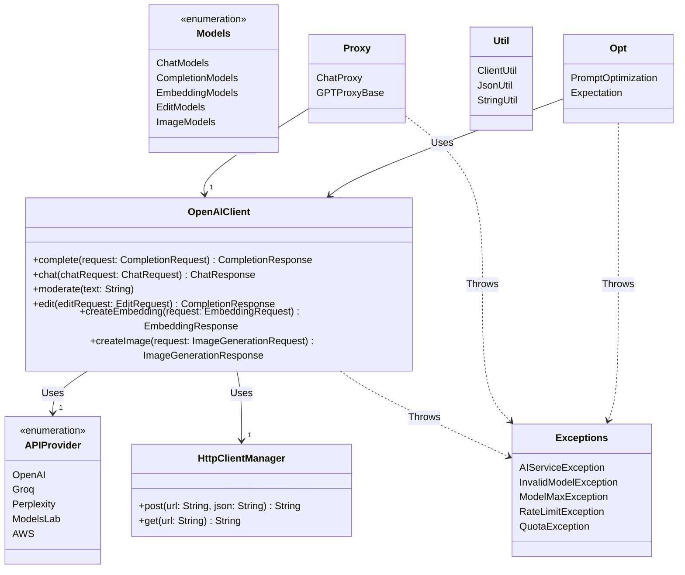

# High-Level Architecture Documentation for OpenAI Integration Framework

## Overview

The OpenAI Integration Framework is designed to facilitate seamless interaction with OpenAI's powerful suite of AI
models, including GPT (Generative Pre-trained Transformer), Codex, and DALL·E. This framework abstracts the complexities
of API communication, providing developers with a structured and extensible approach to leveraging AI capabilities in
their applications. The architecture is modular, ensuring scalability, maintainability, and ease of integration.

## Architecture Components

### 1. Core Components

#### OpenAIClient

- **Description**: Serves as the central client for interacting with OpenAI's API. It encapsulates functionalities for
  various services like text completion, chat, moderation, editing, embeddings, and image generation.
- **Key Features**:
    - Comprehensive API method coverage.
    - Structured request and response handling.
    - Extensible to support additional OpenAI services.

#### APIProvider

- **Description**: Enumerates supported AI service providers, including OpenAI, Groq, Perplexity, ModelsLab, and AWS,
  facilitating easy switch between different AI services.
- **Key Features**:
    - Centralized management of base URLs for AI services.
    - Flexibility in targeting different AI service providers.

#### HttpClientManager

- **Description**: Manages HTTP client operations, including request sending, response handling, and error management.
- **Key Features**:
    - Retry strategies and timeout handling.
    - Error handling and response validation.

### 2. Model Components

#### Models Package (`models`)

- **Description**: Contains classes and enums representing different models provided by OpenAI, such
  as `ChatModels`, `CompletionModels`, `EmbeddingModels`, `EditModels`, and `ImageModels`.
- **Key Features**:
    - Enumerations and classes for model-specific configurations.
    - Pricing calculation based on model usage.

### 3. Optimization and Evaluation Components

#### PromptOptimization

- **Description**: Utilizes genetic algorithms to optimize prompts for chat models, improving response quality based on
  specified criteria.
- **Key Features**:
    - Genetic algorithm implementation for prompt optimization.
    - Evaluation of prompts against test cases.

#### Expectation

- **Description**: Abstract class designed for evaluating responses from the OpenAI API against predefined expectations
  or patterns.
- **Key Features**:
    - Flexible response evaluation framework.
    - Subclasses for different evaluation strategies, e.g., `VectorMatch` and `ContainsMatch`.

### 4. Proxy and Utility Components

#### Proxy Package (`proxy`)

- **Description**: Contains classes like `ChatProxy` and `GPTProxyBase` for creating dynamic proxies that facilitate
  method invocation-based interaction with GPT models.
- **Key Features**:
    - Dynamic proxy creation for simplified API interaction.
    - Example-based learning and response validation.

#### Utility Package (`util`)

- **Description**: Provides utility classes such as `ClientUtil`, `JsonUtil`, and `StringUtil` for common operations
  like error handling, JSON processing, and string manipulation.
- **Key Features**:
    - Comprehensive set of utility functions.
    - Enhanced error handling and JSON serialization/deserialization.

## High-Level Workflow

1. **Initialization**: The application initializes the `OpenAIClient` with appropriate configurations, including API
   keys and target models.
2. **Model Selection**: Based on the application's requirements, specific models from the `models` package are selected
   for tasks like text completion, chat, or image generation.
3. **Request Preparation**: Using proxy classes or directly constructing request objects, the application prepares
   requests for the OpenAI API.
4. **API Interaction**: The `OpenAIClient` sends requests to the OpenAI API, handling retries, timeouts, and error
   responses as needed.
5. **Response Processing**: Responses from the OpenAI API are processed, validated, and optionally optimized or
   evaluated against expectations.
6. **Result Utilization**: The processed results are then utilized within the application, which may involve UI updates,
   further data processing, or triggering additional workflows.

## Conclusion

The OpenAI Integration Framework provides a robust and flexible architecture for leveraging OpenAI's AI models in
various applications. Its modular design, comprehensive coverage of OpenAI services, and extensible components make it
an ideal choice for developers looking to integrate advanced AI capabilities into their solutions.

The `com.simiacryptus.jopenai` package and its subpackages provide a comprehensive framework for interacting with
OpenAI's API, including functionalities for text completion, chat, moderation, editing, embeddings, image generation,
and more. This framework is designed to facilitate the development of applications leveraging OpenAI's powerful AI
models by providing a structured and extensible approach to API communication, response validation, and utility
operations.

### Package Structure Overview

The package is organized into several subpackages and classes, each focusing on specific aspects of interaction with
OpenAI's services or providing utility functions for efficient development. Below is an overview of the main components:



### Key Components

- **`OpenAIClient`**: The core class for interacting with OpenAI's API. It provides methods for various services like
  text completion, chat, moderation, editing, embeddings, and image generation.

- **`APIProvider`**: An enumeration that defines the base URLs for different AI service providers, including OpenAI,
  Groq, Perplexity, ModelsLab, and AWS.

- **`HttpClientManager`**: Manages HTTP client operations, including sending requests and handling responses with
  features like retry strategies and timeout handling.

- **`Models`**: Enumerations and classes representing different models provided by OpenAI, such
  as `ChatModels`, `CompletionModels`, `EmbeddingModels`, `EditModels`, and `ImageModels`.

- **`Proxy`**: Includes `ChatProxy` and `GPTProxyBase`, facilitating dynamic proxy creation for interacting with GPT
  models and handling method invocations to construct requests.

- **`Util`**: Utility classes like `ClientUtil`, `JsonUtil`, and `StringUtil` provide common functionalities for error
  handling, JSON operations, and string manipulation.

- **`Opt`**: Contains classes like `PromptOptimization` and `Expectation` for optimizing prompts using genetic
  algorithms and evaluating responses based on specific criteria.

- **`Exceptions`**: Custom exceptions
  like `AIServiceException`, `InvalidModelException`, `ModelMaxException`, `RateLimitException`, and `QuotaException` to
  handle various error scenarios encountered during API interactions.

### Conclusion

The `com.simiacryptus.jopenai` package offers a robust framework for building applications that leverage OpenAI's AI
models. By abstracting the complexities of API communication and providing a rich set of utilities, it enables
developers to focus on creating innovative features and functionalities powered by AI.

# Models

To summarize the provided code into a data table, we'll focus on the `ChatModels` companion object where various chat
models are defined. The table will include the name, model name, max tokens, provider, input token price per K, and
output token price per K for each model.

 Name                      | Model Name                              | Max Tokens | Provider   | Input Token Price/K | Output Token Price/K |
---------------------------|-----------------------------------------|------------|------------|---------------------|----------------------|
 GPT35Turbo                | gpt-3.5-turbo-0125                      | 16384      | OpenAI     | 0.0005              | 0.0015               |
 GPT4Turbo                 | gpt-4-turbo-preview                     | 128000     | OpenAI     | 0.01                | 0.03                 |
 GPT4Vision                | gpt-4-vision-preview                    | 8192       | OpenAI     | 0.01                | 0.03                 |
 SonarSmallChat            | sonar-small-chat                        | 16384      | Perplexity | 0.0005              | 0.0015               |
 SonarSmallOnline          | sonar-small-online                      | 12000      | Perplexity | 0.0005              | 0.0015               |
 SonarMediumChat           | sonar-medium-chat                       | 16384      | Perplexity | 0.0005              | 0.0015               |
 SonarMediumOnline         | sonar-medium-online                     | 12000      | Perplexity | 0.0005              | 0.0015               |
 Codellama70bInstruct      | codellama-70b-instruct                  | 16384      | Perplexity | 0.0005              | 0.0015               |
 Mistral7bInstruct         | mistral-7b-instruct                     | 16384      | Perplexity | 0.0005              | 0.0015               |
 Mixtral8x7bInstruct       | mixtral-8x7b-instruct                   | 16384      | Perplexity | 0.0005              | 0.0015               |
 LLaMA270bChat             | llama2-70b-4096                         | 4096       | Groq       | 0.0005              | 0.0015               |
 Mixtral8x7bInstructV01    | mixtral-8x7b-32768                      | 32768      | Groq       | 0.0005              | 0.0015               |
 Zephyr7bBeta              | zephyr-7b-beta                          | 16384      | ModelsLab  | 0.0005              | 0.0015               |
 DialoGPTLarge             | DialoGPT-large                          | 16384      | ModelsLab  | 0.0005              | 0.0015               |
 YarnMistral7b128k         | Yarn-Mistral-7b-128k                    | 16384      | ModelsLab  | 0.0005              | 0.0015               |
 Pygmalion13b              | pygmalion-1.3b                          | 16384      | ModelsLab  | 0.0005              | 0.0015               |
 Opt67b                    | opt-6.7b                                | 16384      | ModelsLab  | 0.0005              | 0.0015               |
 MistralLite               | MistralLite                             | 16384      | ModelsLab  | 0.0005              | 0.0015               |
 Openchat35                | openchat_3.5                            | 16384      | ModelsLab  | 0.0005              | 0.0015               |
 NeuralChat7bV3            | neural-chat-7b-v3                       | 16384      | ModelsLab  | 0.0005              | 0.0015               |
 OpenHermes25Mistral7B     | OpenHermes-2.5-Mistral-7B               | 16384      | ModelsLab  | 0.0005              | 0.0015               |
 Dolphin221Mistral7b       | dolphin-2.2.1-mistral-7b                | 16384      | ModelsLab  | 0.0005              | 0.0015               |
 Mistral7BOpenOrca         | Mistral-7B-OpenOrca                     | 16384      | ModelsLab  | 0.0005              | 0.0015               |
 DeepseekCoder67bInstruct  | deepseek-coder-6.7b-instruct            | 16384      | ModelsLab  | 0.0005              | 0.0015               |
 Phi15                     | phi-1_5                                 | 16384      | ModelsLab  | 0.0005              | 0.0015               |
 Zephyr7bAlpha             | zephyr-7b-alpha                         | 16384      | ModelsLab  | 0.0005              | 0.0015               |
 AWSLLaMA270bChat          | meta.llama2-70b-chat-v1                 | 2048       | AWS        | 0.0005              | 0.0015               |
 AWSLLaMA213bChat          | meta.llama2-13b-chat-v1                 | 2048       | AWS        | 0.0005              | 0.0015               |
 Mistral7bInstructV02      | mistral.mistral-7b-instruct-v0:2        | 2048       | AWS        | 0.0005              | 0.0015               |
 Mixtral8x7bInstructV01AWS | mistral.mixtral-8x7b-instruct-v0:1      | 2048       | AWS        | 0.0005              | 0.0015               |
 AmazonTitanTextLiteV1     | amazon.titan-text-lite-v1               | 4096       | AWS        | 0.0005              | 0.0015               |
 AmazonTitanTextExpressV1  | amazon.titan-text-express-v1            | 8192       | AWS        | 0.0005              | 0.0015               |
 CohereCommandTextV14      | cohere.command-text-v14                 | 4000       | AWS        | 0.0005              | 0.0015               |
 AI21J2UltraV1             | ai21.j2-ultra-v1                        | 8191       | AWS        | 0.0005              | 0.0015               |
 AI21J2MidV1               | ai21.j2-mid-v1                          | 8191       | AWS        | 0.0005              | 0.0015               |
 Claude3Sonnet             | anthropic.claude-3-sonnet-20240229-v1:0 | 200000     | AWS        | 0.0005              | 0.0015               |
 Claude3Haiku              | anthropic.claude-3-haiku-20240307-v1:0  | 200000     | AWS        | 0.0005              | 0.0015               |
 ClaudeV2_1                | anthropic.claude-v2:1                   | 100000     | AWS        | 0.0005              | 0.0015               |
 ClaudeV2                  | anthropic.claude-v2                     | 100000     | AWS        | 0.0005              | 0.0015               |
 ClaudeV2Instant           | anthropic.claude-instant-v1             | 100000     | AWS        | 0.0005              | 0.0015               |

This table represents a concise summary of the chat models defined in the code, including their key attributes.


<!-- TOC -->

* [High-Level Architecture Documentation for OpenAI Integration Framework](#high-level-architecture-documentation-for-openai-integration-framework)
    * [Overview](#overview)
    * [Architecture Components](#architecture-components)
        * [1. Core Components](#1-core-components)
            * [OpenAIClient](#openaiclient)
            * [APIProvider](#apiprovider)
            * [HttpClientManager](#httpclientmanager)
        * [2. Model Components](#2-model-components)
            * [Models Package (`models`)](#models-package-models)
        * [3. Optimization and Evaluation Components](#3-optimization-and-evaluation-components)
            * [PromptOptimization](#promptoptimization)
            * [Expectation](#expectation)
        * [4. Proxy and Utility Components](#4-proxy-and-utility-components)
            * [Proxy Package (`proxy`)](#proxy-package-proxy)
            * [Utility Package (`util`)](#utility-package-util)
    * [High-Level Workflow](#high-level-workflow)
    * [Conclusion](#conclusion)
        * [Package Structure Overview](#package-structure-overview)
        * [Key Components](#key-components)
        * [Conclusion](#conclusion-1)
* [Models](#models)
* [ChatProxy Feature](#chatproxy-feature)
    * [Overview](#overview-1)
    * [Key Components](#key-components-1)
        * [`ChatProxy`](#chatproxy)
        * [`GPTProxyBase`](#gptproxybase)
        * [`ValidatedObject`](#validatedobject)
    * [How It Works](#how-it-works)
    * [Usage Example](#usage-example)
* [Prompt Optimization Developer Documentation](#prompt-optimization-developer-documentation)
    * [Overview](#overview-2)
    * [Key Components](#key-components-2)
        * [PromptOptimization Class](#promptoptimization-class)
            * [Constructor Parameters](#constructor-parameters)
            * [Methods](#methods)
        * [TestCase and Turn Classes](#testcase-and-turn-classes)
    * [Usage](#usage)
        * [Example](#example)
    * [Customization](#customization)
        * [Mutation Types](#mutation-types)
        * [Evaluation Criteria](#evaluation-criteria)
    * [Conclusion](#conclusion-2)
* [API.kt](#apikt)
    * [Overview](#overview-3)
    * [Class Declaration](#class-declaration)
        * [Key Features:](#key-features)
    * [Usage](#usage-1)
        * [Example:](#example-1)
    * [Extending the API Class](#extending-the-api-class)
    * [Conclusion](#conclusion-3)
* [audio\AudioRecorder.kt](#audioaudiorecorderkt)
    * [AudioRecorder Class Documentation](#audiorecorder-class-documentation)
        * [Dependencies](#dependencies)
        * [Class Overview](#class-overview)
            * [Constructor Parameters](#constructor-parameters-1)
            * [Properties](#properties)
            * [Methods](#methods-1)
            * [Companion Object](#companion-object)
                * [Properties](#properties-1)
                * [Methods](#methods-2)
        * [Usage Example](#usage-example-1)
        * [Notes](#notes)
* [ApiModel.kt](#apimodelkt)
    * [JOpenAI API Model Interface Documentation](#jopenai-api-model-interface-documentation)
        * [Overview](#overview-4)
        * [Data Classes](#data-classes)
            * [Common Data Classes](#common-data-classes)
            * [Completion Services](#completion-services)
            * [Chat Services](#chat-services)
            * [Speech and Transcription Services](#speech-and-transcription-services)
            * [Image Services](#image-services)
            * [Embedding Services](#embedding-services)
        * [Utility Methods](#utility-methods)
        * [Usage Example](#usage-example-2)
        * [Conclusion](#conclusion-4)
* [audio\AudioPacket.kt](#audioaudiopacketkt)
    * [AudioPacket Class Documentation](#audiopacket-class-documentation)
        * [Class Structure](#class-structure)
            * [Properties](#properties-2)
            * [Methods](#methods-3)
            * [Companion Object Methods](#companion-object-methods)
            * [Private Methods](#private-methods)
        * [Usage](#usage-2)
            * [Creating an AudioPacket](#creating-an-audiopacket)
            * [Performing Operations](#performing-operations)
            * [Converting Audio Data](#converting-audio-data)
        * [Conclusion](#conclusion-5)
* [audio\LoudnessWindowBuffer.kt](#audioloudnesswindowbufferkt)
    * [LoudnessWindowBuffer Class Documentation](#loudnesswindowbuffer-class-documentation)
        * [Class Structure](#class-structure-1)
            * [Properties](#properties-3)
            * [Constructor](#constructor)
            * [Methods](#methods-4)
            * [Companion Object](#companion-object-1)
        * [Usage](#usage-3)
            * [Example](#example-2)
        * [Conclusion](#conclusion-6)
* [audio\LookbackLoudnessWindowBuffer.kt](#audiolookbackloudnesswindowbufferkt)
    * [LookbackLoudnessWindowBuffer Class Documentation](#lookbackloudnesswindowbuffer-class-documentation)
        * [Overview](#overview-5)
        * [Constructor](#constructor-1)
        * [Properties](#properties-4)
        * [Methods](#methods-5)
            * [shouldOutput](#shouldoutput)
            * [percentile](#percentile)
            * [statistics](#statistics)
        * [Companion Object](#companion-object-2)
        * [Usage Example](#usage-example-3)
* [audio\TranscriptionProcessor.kt](#audiotranscriptionprocessorkt)
    * [TranscriptionProcessor Class Documentation](#transcriptionprocessor-class-documentation)
        * [Overview](#overview-6)
        * [Constructor Parameters](#constructor-parameters-2)
        * [Methods](#methods-6)
            * [run()](#run)
        * [Usage Example](#usage-example-4)
* [audio\PercentileLoudnessWindowBuffer.kt](#audiopercentileloudnesswindowbufferkt)
    * [PercentileLoudnessWindowBuffer Class Documentation](#percentileloudnesswindowbuffer-class-documentation)
        * [Overview](#overview-7)
        * [Key Features](#key-features-1)
        * [Usage](#usage-4)
        * [Key Methods](#key-methods)
            * [shouldOutput](#shouldoutput-1)
        * [Configuration Properties](#configuration-properties)
        * [Internal Data Structures](#internal-data-structures)
        * [Logging](#logging)
        * [Example Log Output](#example-log-output)
        * [Conclusion](#conclusion-7)
* [describe\ApiFunctionDescriber.kt](#describeapifunctiondescriberkt)
    * [ApiFunctionDescriber Class Documentation](#apifunctiondescriber-class-documentation)
        * [Overview](#overview-8)
        * [Properties](#properties-5)
        * [Methods](#methods-7)
            * [`describe(Method, Class<*>, Int): String`](#describemethod-class-int-string)
            * [`describe(Class<in Nothing>, Int, MutableSet<String>): String`](#describeclassin-nothing-int-mutablesetstring-string)
            * [`describe(Parameter, Int): String`](#describeparameter-int-string)
            * [`toApiFunctionFormat(Type, Int, MutableSet<String>): String`](#toapifunctionformattype-int-mutablesetstring-string)
        * [Private Methods](#private-methods-1)
            * [`describeKotlinClass(KClass<out Any>, Int): String`](#describekotlinclasskclassout-any-int-string)
            * [`describeJavaClass(Class<in Nothing>, Int): String`](#describejavaclassclassin-nothing-int-string)
        * [Usage](#usage-5)
        * [Example](#example-3)
* [describe\AbbrevWhitelistYamlDescriber.kt](#describeabbrevwhitelistyamldescriberkt)
    * [AbbrevWhitelistYamlDescriber Class Documentation](#abbrevwhitelistyamldescriber-class-documentation)
        * [Usage](#usage-6)
        * [Constructor](#constructor-2)
            * [Parameters:](#parameters)
        * [Methods](#methods-8)
            * [isAbbreviated](#isabbreviated)
                * [Parameters:](#parameters-1)
                * [Returns:](#returns)
                * [Logic:](#logic)
        * [Example Usage](#example-usage)
        * [Dependencies](#dependencies-1)
        * [Package](#package)
* [describe\Description.kt](#describedescriptionkt)
    * [Overview](#overview-9)
    * [Annotation Definition](#annotation-definition)
        * [Attributes](#attributes)
        * [Retention Policy](#retention-policy)
    * [Usage](#usage-7)
        * [Annotating a Class](#annotating-a-class)
        * [Annotating a Method](#annotating-a-method)
        * [Annotating a Field](#annotating-a-field)
    * [Best Practices](#best-practices)
    * [Conclusion](#conclusion-8)
* [describe\DescriptorUtil.kt](#describedescriptorutilkt)
    * [DescriptorUtil Module Documentation](#descriptorutil-module-documentation)
        * [Overview](#overview-10)
        * [Functions and Properties](#functions-and-properties)
            * [getAllAnnotations](#getallannotations)
                * [Parameters:](#parameters-2)
                * [Returns:](#returns-1)
            * [isArray (Property)](#isarray-property)
                * [Returns:](#returns-2)
            * [componentType (Property)](#componenttype-property)
                * [Returns:](#returns-3)
            * [resolveMethodReturnType](#resolvemethodreturntype)
                * [Parameters:](#parameters-3)
                * [Returns:](#returns-4)
            * [resolveGenericType](#resolvegenerictype)
                * [Parameters:](#parameters-4)
                * [Returns:](#returns-5)
        * [Usage Example](#usage-example-5)
        * [Conclusion](#conclusion-9)
* [describe\JsonDescriber.kt](#describejsondescriberkt)
    * [JsonDescriber Class Documentation](#jsondescriber-class-documentation)
        * [Features](#features)
        * [Usage](#usage-8)
            * [Example](#example-4)
        * [Methods](#methods-9)
            * [describe(Class<in Nothing>, Int, MutableSet<String>): String](#describeclassin-nothing-int-mutablesetstring-string-1)
            * [describe(Method, Class<*>, Int): String](#describemethod-class-int-string-1)
        * [Configuration](#configuration)
        * [Extensibility](#extensibility)
        * [Logging](#logging-1)
        * [Conclusion](#conclusion-10)
* [describe\TypeDescriber.kt](#describetypedescriberkt)
    * [TypeDescriber Class Documentation](#typedescriber-class-documentation)
        * [Overview](#overview-11)
        * [Key Features](#key-features-2)
        * [Properties](#properties-6)
        * [Methods](#methods-10)
            * [Abstract Methods](#abstract-methods)
            * [Open Methods](#open-methods)
        * [Companion Object](#companion-object-3)
        * [Usage](#usage-9)
* [exceptions\AIServiceException.kt](#exceptionsaiserviceexceptionkt)
    * [AIServiceException Class Documentation](#aiserviceexception-class-documentation)
        * [Package](#package-1)
        * [Import Statement](#import-statement)
        * [Description](#description)
        * [Usage](#usage-10)
        * [Constructors](#constructors)
            * [AIServiceException(String? message)](#aiserviceexceptionstring-message)
        * [Inheritance](#inheritance)
        * [Methods](#methods-11)
        * [Best Practices](#best-practices-1)
        * [Conclusion](#conclusion-11)
* [describe\YamlDescriber.kt](#describeyamldescriberkt)
    * [YamlDescriber Class Documentation](#yamldescriber-class-documentation)
        * [Key Features](#key-features-3)
        * [Usage](#usage-11)
        * [Methods Overview](#methods-overview)
            * [describe(Class<in Nothing>, Int, MutableSet<String>): String](#describeclassin-nothing-int-mutablesetstring-string-2)
            * [describe(Method, Class<*>, Int): String](#describemethod-class-int-string-2)
            * [describe(KFunction<*>, KClass<*>, Int, Boolean, MutableSet<String>): String](#describekfunction-kclass-int-boolean-mutablesetstring-string)
        * [Configuration Properties](#configuration-properties-1)
        * [Utility Methods](#utility-methods-1)
        * [Extensibility](#extensibility-1)
        * [Example Output](#example-output)
* [exceptions\InvalidValueException.kt](#exceptionsinvalidvalueexceptionkt)
    * [InvalidValueException Documentation](#invalidvalueexception-documentation)
        * [Overview](#overview-12)
        * [Class Definition](#class-definition)
        * [Constructor Parameters](#constructor-parameters-3)
        * [Usage](#usage-12)
            * [Example](#example-5)
        * [Best Practices](#best-practices-2)
        * [Conclusion](#conclusion-12)
* [exceptions\InvalidModelException.kt](#exceptionsinvalidmodelexceptionkt)
    * [InvalidModelException Class Documentation](#invalidmodelexception-class-documentation)
        * [Package](#package-2)
        * [Description](#description-1)
        * [Usage](#usage-13)
        * [Constructor](#constructor-3)
            * [Parameters:](#parameters-5)
            * [Example:](#example-6)
        * [Inheritance](#inheritance-1)
        * [Error Message](#error-message)
        * [Handling `InvalidModelException`](#handling-invalidmodelexception)
            * [Example:](#example-7)
        * [Summary](#summary)
* [exceptions\ModelMaxException.kt](#exceptionsmodelmaxexceptionkt)
    * [ModelMaxException Class Documentation](#modelmaxexception-class-documentation)
        * [Package](#package-3)
        * [Description](#description-2)
        * [Constructors](#constructors-1)
            * [ModelMaxException](#modelmaxexception)
                * [Parameters:](#parameters-6)
        * [Properties](#properties-7)
            * [request](#request)
            * [messages](#messages)
        * [Inheritance](#inheritance-2)
        * [Usage](#usage-14)
        * [Example](#example-8)
* [exceptions\ModerationException.kt](#exceptionsmoderationexceptionkt)
    * [ModerationException Class Documentation](#moderationexception-class-documentation)
        * [Package](#package-4)
        * [Description](#description-3)
        * [Usage](#usage-15)
        * [Constructor](#constructor-4)
            * [Parameters:](#parameters-7)
        * [Example Usage](#example-usage-1)
        * [Best Practices](#best-practices-3)
        * [Conclusion](#conclusion-13)
* [exceptions\RateLimitException.kt](#exceptionsratelimitexceptionkt)
    * [RateLimitException Class Documentation](#ratelimitexception-class-documentation)
        * [Package](#package-5)
        * [Description](#description-4)
        * [Constructors](#constructors-2)
            * [RateLimitException](#ratelimitexception)
                * [Parameters:](#parameters-8)
        * [Properties](#properties-8)
        * [Inheritance](#inheritance-3)
        * [Example Usage](#example-usage-2)
        * [Notes](#notes-1)
* [exceptions\QuotaException.kt](#exceptionsquotaexceptionkt)
    * [QuotaException Class Documentation](#quotaexception-class-documentation)
        * [Package](#package-6)
        * [Overview](#overview-13)
        * [Usage](#usage-16)
        * [Example](#example-9)
        * [Constructor](#constructor-5)
            * [Syntax](#syntax)
        * [Inheritance](#inheritance-4)
        * [See Also](#see-also)
        * [Notes](#notes-2)
        * [Conclusion](#conclusion-14)
* [exceptions\RequestOverloadException.kt](#exceptionsrequestoverloadexceptionkt)
    * [RequestOverloadException Class Documentation](#requestoverloadexception-class-documentation)
        * [Package](#package-7)
        * [Import Statement](#import-statement-1)
        * [Description](#description-5)
        * [Usage](#usage-17)
        * [Constructor](#constructor-6)
            * [Parameters:](#parameters-9)
        * [Inheritance](#inheritance-5)
        * [Example Usage](#example-usage-3)
        * [Best Practices](#best-practices-4)
        * [Conclusion](#conclusion-15)
* [exceptions\SafetyException.kt](#exceptionssafetyexceptionkt)
    * [SafetyException Class Documentation](#safetyexception-class-documentation)
        * [Package](#package-8)
        * [Overview](#overview-14)
        * [Usage](#usage-18)
        * [Declaration](#declaration)
        * [Constructor](#constructor-7)
            * [Parameters](#parameters-10)
        * [Inheritance](#inheritance-6)
        * [Example Usage](#example-usage-4)
        * [Best Practices](#best-practices-5)
        * [See Also](#see-also-1)
* [GPT4Tokenizer.kt](#gpt4tokenizerkt)
    * [GPT4Tokenizer Documentation](#gpt4tokenizer-documentation)
        * [Features](#features-1)
        * [Usage](#usage-19)
            * [Initialization](#initialization)
            * [Encoding Text](#encoding-text)
            * [Decoding Tokens](#decoding-tokens)
            * [Encoding to UTF-8 Bytes](#encoding-to-utf-8-bytes)
            * [Decoding UTF-8 Bytes](#decoding-utf-8-bytes)
            * [Estimating Token Count](#estimating-token-count)
            * [Chunking Text](#chunking-text)
        * [Internal Components](#internal-components)
            * [TextEncoder and TextDecoder](#textencoder-and-textdecoder)
            * [Companion Object](#companion-object-4)
        * [Initialization Process](#initialization-process)
        * [Error Handling](#error-handling)
        * [Conclusion](#conclusion-16)
* [models\APIProvider.kt](#modelsapiproviderkt)
    * [APIProvider Enum Documentation](#apiprovider-enum-documentation)
        * [Enum Constants](#enum-constants)
        * [Usage](#usage-20)
            * [Example:](#example-10)
        * [Fields](#fields)
        * [Constructor](#constructor-8)
            * [Parameters:](#parameters-11)
        * [Conclusion](#conclusion-17)
* [HttpClientManager.kt](#httpclientmanagerkt)
    * [HttpClientManager Class Documentation](#httpclientmanager-class-documentation)
        * [Dependencies](#dependencies-2)
        * [Key Components](#key-components-3)
            * [Companion Object](#companion-object-5)
                * [Thread Pools](#thread-pools)
                * [HTTP Client](#http-client)
                * [Exception Unwrapping Methods](#exception-unwrapping-methods)
            * [Constructor Parameters](#constructor-parameters-4)
            * [Methods](#methods-12)
                * [withPool](#withpool)
                * [withExpBackoffRetry](#withexpbackoffretry)
                * [unwrapException](#unwrapexception)
                * [withCancellationMonitor](#withcancellationmonitor)
                * [withTimeout](#withtimeout)
                * [withReliability](#withreliability)
                * [withPerformanceLogging](#withperformancelogging)
                * [withClient](#withclient)
                * [log](#log)
        * [Usage](#usage-21)
* [models\AudioModels.kt](#modelsaudiomodelskt)
    * [AudioModels Enum Documentation](#audiomodels-enum-documentation)
        * [Enum Values](#enum-values)
        * [Methods](#methods-13)
            * [pricing](#pricing)
                * [Parameters](#parameters-12)
                * [Returns](#returns-6)
                * [Pricing Calculation](#pricing-calculation)
        * [Usage Example](#usage-example-6)
        * [Note](#note)
* [models\CompletionModels.kt](#modelscompletionmodelskt)
    * [CompletionModels Class Documentation](#completionmodels-class-documentation)
        * [Class Declaration](#class-declaration-1)
            * [Parameters](#parameters-13)
        * [Methods](#methods-14)
            * [`pricing`](#pricing-1)
                * [Parameters](#parameters-14)
                * [Returns](#returns-7)
        * [Companion Object](#companion-object-6)
            * [`values`](#values)
                * [Returns](#returns-8)
            * [Predefined Models](#predefined-models)
        * [Usage Example](#usage-example-7)
* [models\ChatModels.kt](#modelschatmodelskt)
    * [ChatModels Documentation](#chatmodels-documentation)
        * [Overview](#overview-15)
        * [Properties](#properties-9)
        * [Methods](#methods-15)
            * [`pricing(usage: Usage)`](#pricingusage-usage)
        * [Companion Object](#companion-object-7)
            * [`values()`](#values-1)
        * [Serialization and Deserialization](#serialization-and-deserialization)
            * [`ChatModelsSerializer`](#chatmodelsserializer)
            * [`ChatModelsDeserializer`](#chatmodelsdeserializer)
        * [Usage Example](#usage-example-8)
        * [Serialization Example](#serialization-example)
        * [Deserialization Example](#deserialization-example)
* [models\EditModels.kt](#modelseditmodelskt)
    * [EditModels Class Documentation](#editmodels-class-documentation)
        * [Class Overview](#class-overview-1)
        * [Constructor Parameters](#constructor-parameters-5)
        * [Methods](#methods-16)
            * [`pricing(usage: Usage): Double`](#pricingusage-usage-double)
            * [`companion object`](#companion-object-8)
                * [`values(): Map<String, EditModels>`](#values-mapstring-editmodels)
                * [Private Properties](#private-properties)
        * [Usage Example](#usage-example-9)
        * [Notes](#notes-3)
* [models\EmbeddingModels.kt](#modelsembeddingmodelskt)
    * [EmbeddingModels Class Documentation](#embeddingmodels-class-documentation)
        * [Class Overview](#class-overview-2)
        * [Constructor Parameters](#constructor-parameters-6)
        * [Methods](#methods-17)
            * [`pricing(usage: Usage): Double`](#pricingusage-usage-double-1)
        * [Companion Object](#companion-object-9)
            * [Predefined Instances](#predefined-instances)
            * [`values()`: Map<String, EmbeddingModels>](#values-mapstring-embeddingmodels)
        * [Usage Example](#usage-example-10)
        * [Conclusion](#conclusion-18)
* [models\ImageModels.kt](#modelsimagemodelskt)
    * [ImageModels Enum Documentation](#imagemodels-enum-documentation)
        * [Enum Constants](#enum-constants-1)
            * [Properties](#properties-10)
            * [Methods](#methods-18)
        * [Enum Constant Details](#enum-constant-details)
            * [DallE2](#dalle2)
            * [DallE3](#dalle3)
            * [DallE3_HD](#dalle3_hd)
        * [Usage](#usage-22)
        * [Exception Handling](#exception-handling)
* [models\OpenAIModel.kt](#modelsopenaimodelkt)
    * [OpenAIModel Interface Documentation](#openaimodel-interface-documentation)
        * [Package](#package-9)
        * [Overview](#overview-16)
        * [Interface Definition](#interface-definition)
            * [Properties](#properties-11)
        * [Implementation Guidelines](#implementation-guidelines)
        * [Usage](#usage-23)
        * [Conclusion](#conclusion-19)
* [ModelsLabDataModel.kt](#modelslabdatamodelkt)
    * [ModelsLabDataModel Documentation](#modelslabdatamodel-documentation)
        * [Overview](#overview-17)
            * [ChatRequest](#chatrequest)
            * [ChatResponse](#chatresponse)
            * [Meta](#meta)
        * [Usage](#usage-24)
        * [Conclusion](#conclusion-20)
* [models\OpenAITextModel.kt](#modelsopenaitextmodelkt)
    * [OpenAITextModel Serialization and Deserialization](#openaitextmodel-serialization-and-deserialization)
        * [Overview](#overview-18)
        * [OpenAITextModel Class](#openaitextmodel-class)
            * [Properties](#properties-12)
            * [Methods](#methods-19)
        * [OpenAITextModelSerializer Class](#openaitextmodelserializer-class)
            * [Serialization Logic](#serialization-logic)
        * [OpenAITextModelDeserializer Class](#openaitextmodeldeserializer-class)
            * [Deserialization Logic](#deserialization-logic)
        * [Usage](#usage-25)
        * [Conclusion](#conclusion-21)
* [opt\DistanceType.kt](#optdistancetypekt)
    * [DistanceType Enum Documentation](#distancetype-enum-documentation)
        * [Enum Values](#enum-values-1)
            * [Euclidean](#euclidean)
            * [Manhattan](#manhattan)
            * [Cosine](#cosine)
        * [Usage Example](#usage-example-11)
        * [Conclusion](#conclusion-22)
* [OpenAIClient.kt](#openaiclientkt)
    * [OpenAIClient Class Documentation](#openaiclient-class-documentation)
        * [Constructor](#constructor-9)
            * [Parameters:](#parameters-15)
        * [Methods](#methods-20)
            * [`onUsage(model: OpenAIModel?, tokens: Usage)`](#onusagemodel-openaimodel-tokens-usage)
            * [`post(url: String, json: String, apiProvider: APIProvider): String`](#posturl-string-json-string-apiprovider-apiprovider-string)
            * [`authorize(request: HttpRequest, apiProvider: APIProvider)`](#authorizerequest-httprequest-apiprovider-apiprovider)
            * [`get(url: String?, apiProvider: APIProvider): String`](#geturl-string-apiprovider-apiprovider-string)
            * [`listEngines(): List<Engine>`](#listengines-listengine)
            * [`getEngineIds(): Array<CharSequence?>`](#getengineids-arraycharsequence)
            * [`complete(request: CompletionRequest, model: OpenAITextModel): CompletionResponse`](#completerequest-completionrequest-model-openaitextmodel-completionresponse)
            * [`transcription(wavAudio: ByteArray, prompt: String = ""): String`](#transcriptionwavaudio-bytearray-prompt-string---string)
            * [`createSpeech(request: SpeechRequest): ByteArray?`](#createspeechrequest-speechrequest-bytearray)
            * [
              `render(prompt: String = "", resolution: Int = 1024, count: Int = 1): List<BufferedImage>`](#renderprompt-string---resolution-int--1024-count-int--1-listbufferedimage)
            * [`chat(chatRequest: ChatRequest, model: ChatModels): ChatResponse`](#chatchatrequest-chatrequest-model-chatmodels-chatresponse)
            * [`moderate(text: String)`](#moderatetext-string)
            * [`edit(editRequest: EditRequest): CompletionResponse`](#editeditrequest-editrequest-completionresponse)
            * [`listModels(): ModelListResponse`](#listmodels-modellistresponse)
            * [`createEmbedding(request: EmbeddingRequest): EmbeddingResponse`](#createembeddingrequest-embeddingrequest-embeddingresponse)
            * [`createImage(request: ImageGenerationRequest): ImageGenerationResponse`](#createimagerequest-imagegenerationrequest-imagegenerationresponse)
            * [`createImageEdit(request: ImageEditRequest): ImageEditResponse`](#createimageeditrequest-imageeditrequest-imageeditresponse)
            * [`createImageVariation(request: ImageVariationRequest): ImageVariationResponse`](#createimagevariationrequest-imagevariationrequest-imagevariationresponse)
        * [Companion Object](#companion-object-10)
        * [Usage Example](#usage-example-12)
* [opt\PromptOptimization.kt](#optpromptoptimizationkt)
    * [PromptOptimization Class Documentation](#promptoptimization-class-documentation)
        * [Dependencies](#dependencies-3)
        * [Key Components](#key-components-4)
            * [Constructor](#constructor-10)
            * [Data Classes](#data-classes-1)
            * [Methods](#methods-21)
                * [runGeneticGenerations](#rungeneticgenerations)
                * [regenerate](#regenerate)
                * [recombine](#recombine)
                * [mutate](#mutate)
                * [getMutationDirective](#getmutationdirective)
                * [evaluate](#evaluate)
                * [run](#run-1)
        * [Usage Example](#usage-example-13)
        * [Logging](#logging-2)
        * [Conclusion](#conclusion-23)
* [opt\Expectation.kt](#optexpectationkt)
    * [Developer Documentation for Expectation Module](#developer-documentation-for-expectation-module)
        * [Overview](#overview-19)
        * [Core Classes](#core-classes)
            * [`Expectation`](#expectation-1)
                * [Abstract Methods](#abstract-methods-1)
            * [`VectorMatch`](#vectormatch)
                * [Parameters](#parameters-16)
                * [Key Methods](#key-methods-1)
            * [`ContainsMatch`](#containsmatch)
                * [Parameters](#parameters-17)
                * [Key Methods](#key-methods-2)
        * [Usage](#usage-26)
            * [Example](#example-11)
        * [Logging](#logging-3)
        * [Conclusion](#conclusion-24)
* [proxy\ValidatedObject.kt](#proxyvalidatedobjectkt)
    * [ValidatedObject Interface Documentation](#validatedobject-interface-documentation)
        * [Overview](#overview-20)
        * [Usage](#usage-27)
            * [Example](#example-12)
        * [ValidationError Class](#validationerror-class)
            * [Properties](#properties-13)
            * [Usage](#usage-28)
        * [Companion Object](#companion-object-11)
            * [validateFields Method](#validatefields-method)
                * [Parameters](#parameters-18)
                * [Returns](#returns-9)
            * [Usage](#usage-29)
        * [Conclusion](#conclusion-25)
* [proxy\ChatProxy.kt](#proxychatproxykt)
    * [ChatProxy Class Documentation](#chatproxy-class-documentation)
        * [Overview](#overview-21)
        * [Constructors](#constructors-3)
            * [Primary Constructor](#primary-constructor)
            * [Secondary Constructor](#secondary-constructor)
        * [Properties](#properties-14)
        * [Methods](#methods-22)
            * [complete](#complete)
            * [trimPrefix](#trimprefix)
            * [trimSuffix](#trimsuffix)
            * [argsToString](#argstostring)
        * [Usage Example](#usage-example-14)
* [util\ClientUtil.kt](#utilclientutilkt)
    * [ClientUtil Module Documentation](#clientutil-module-documentation)
        * [Overview](#overview-22)
        * [Functions and Properties](#functions-and-properties-1)
            * [Error Handling](#error-handling-1)
            * [API Key Management](#api-key-management)
            * [Utility Functions](#utility-functions)
            * [Constants and Patterns](#constants-and-patterns)
        * [Exceptions](#exceptions)
        * [Usage](#usage-30)
        * [Conclusion](#conclusion-26)
* [proxy\GPTProxyBase.kt](#proxygptproxybasekt)
    * [GPTProxyBase Class Documentation](#gptproxybase-class-documentation)
        * [Overview](#overview-23)
        * [Key Components](#key-components-5)
            * [Constructor Parameters](#constructor-parameters-7)
            * [Methods](#methods-23)
            * [Inner Data Classes](#inner-data-classes)
            * [Companion Object](#companion-object-12)
        * [Usage](#usage-31)
        * [Example](#example-13)
        * [Notes](#notes-4)
* [util\JsonUtil.kt](#utiljsonutilkt)
    * [JsonUtil Documentation](#jsonutil-documentation)
        * [Features](#features-2)
        * [Usage](#usage-32)
            * [Object Mapper Configuration](#object-mapper-configuration)
            * [Serialization to JSON](#serialization-to-json)
            * [Deserialization from JSON](#deserialization-from-json)
        * [Configuration Details](#configuration-details)
        * [Limitations](#limitations)
        * [Conclusion](#conclusion-27)
* [util\StringUtil.kt](#utilstringutilkt)
    * [StringUtil Class Documentation](#stringutil-class-documentation)
        * [Methods](#methods-24)
            * [`stripPrefix(text: CharSequence, prefix: CharSequence): CharSequence`](#stripprefixtext-charsequence-prefix-charsequence-charsequence)
            * [`trimPrefix(text: CharSequence): CharSequence`](#trimprefixtext-charsequence-charsequence)
            * [`trimSuffix(text: CharSequence): String`](#trimsuffixtext-charsequence-string)
            * [`stripSuffix(text: CharSequence, suffix: CharSequence): String`](#stripsuffixtext-charsequence-suffix-charsequence-string)
            * [`lineWrapping(description: CharSequence, width: Int): String`](#linewrappingdescription-charsequence-width-int-string)
            * [`toString(ints: IntArray): CharSequence`](#tostringints-intarray-charsequence)
            * [`getWhitespacePrefix(vararg lines: CharSequence): CharSequence`](#getwhitespaceprefixvararg-lines-charsequence-charsequence)
            * [`getWhitespaceSuffix(vararg lines: CharSequence): String`](#getwhitespacesuffixvararg-lines-charsequence-string)
            * [`trim(items: List<CharSequence>, max: Int, preserveHead: Boolean): List<CharSequence>`](#trimitems-listcharsequence-max-int-preservehead-boolean-listcharsequence)
            * [
              `getPrefixForContext(text: String, idealLength: Int, vararg delimiters: CharSequence?): CharSequence`](#getprefixforcontexttext-string-ideallength-int-vararg-delimiters-charsequence-charsequence)
            * [
              `getSuffixForContext(text: String, idealLength: Int, vararg delimiters: CharSequence?): CharSequence`](#getsuffixforcontexttext-string-ideallength-int-vararg-delimiters-charsequence-charsequence)
            * [`restrictCharacterSet(text: String, charset: Charset): String`](#restrictcharactersettext-string-charset-charset-string)
        * [Usage Example](#usage-example-15)

<!-- TOC -->

# ChatProxy Feature

The virtual API feature, as implemented in the provided Kotlin code, allows for the dynamic creation of API endpoints
that leverage the capabilities of OpenAI's GPT models to process and respond to requests. This feature is particularly
useful for simulating or proxying APIs with complex logic without the need for explicit programming for each endpoint.
Below is a detailed documentation of the key components and functionalities of the virtual API feature.

### Overview

The virtual API feature is built around several Kotlin classes, primarily `ChatProxy`, `GPTProxyBase`,
and `ValidatedObject`, which work together to dynamically generate responses to API requests by communicating with
OpenAI's GPT models. The system is designed to be flexible, allowing for easy customization of the model used, the
temperature (creativity) of the responses, and the validation of the generated responses.

### Key Components

#### `ChatProxy`

- **Purpose**: `ChatProxy` is a specialized proxy that handles chat-based interactions with an OpenAI GPT model. It is
  designed to format requests and responses in a way that is suitable for chat-based communication.
- **Key Features**:
    - **Dynamic Request Handling**: It can dynamically construct chat requests based on method calls to the proxy,
      including handling of various input arguments and formatting them appropriately.
    - **Response Processing**: It processes the responses from the GPT model, trimming unnecessary prefixes and
      suffixes, and ensuring the response is in the expected format.
    - **Metrics Collection**: It collects various metrics related to the requests and responses, such as input and
      output lengths, which can be useful for monitoring and debugging.

#### `GPTProxyBase`

- **Purpose**: Serves as the base class for creating proxies that interact with GPT models. It provides the core
  functionality for making requests to the models and processing their responses.
- **Key Features**:
    - **Proxy Creation**: It uses Kotlin's `Proxy` mechanism to dynamically create API endpoints based on the provided
      interface.
    - **Response Validation**: It supports validation of the generated responses to ensure they meet certain criteria,
      which can be customized by implementing the `ValidatedObject` interface.
    - **Retry Logic**: It implements retry logic with temperature adjustment to encourage the model to generate
      different responses on subsequent attempts if the initial response is not satisfactory.

#### `ValidatedObject`

- **Purpose**: Provides a mechanism for validating the objects generated by the GPT model to ensure they meet certain
  criteria.
- **Key Features**:
    - **Custom Validation**: Classes implementing this interface can define custom validation logic by overriding
      the `validate` method.

### How It Works

1. **Proxy Creation**: An instance of `ChatProxy` is created, specifying the class of the API interface, the OpenAI
   client, and other configuration options.
2. **API Call Simulation**: When a method on the proxy instance is called, it constructs a `ChatRequest` based on the
   method name, arguments, and additional metadata.
3. **Request Processing**: The request is sent to the OpenAI GPT model, which generates a response based on the input.
4. **Response Handling**: The response from the model is processed by `ChatProxy`, trimming unnecessary parts and
   converting it into the expected format.
5. **Validation (Optional)**: If the response object implements `ValidatedObject`, its `validate` method is called to
   ensure the response meets the defined criteria.

### Usage Example

```kotlin
val apiClient = OpenAIClient(apiKey = "your_api_key")
val chatProxy = ChatProxy(
    clazz = YourApiInterface::class.java,
    api = apiClient,
    model = ChatModels.Gpt3_5Turbo,
    temperature = 0.5
)

val yourApi = chatProxy.create()
val response = yourApi.yourMethod(yourArguments)
```

This documentation provides a comprehensive overview of the virtual API feature, detailing its key components,
functionalities, and usage.

# Prompt Optimization Developer Documentation

The Prompt Optimization feature is designed to enhance the quality of prompts used in chat models by employing genetic
algorithms. This document provides an overview of the implementation, usage, and customization options available for
developers integrating or modifying prompt optimization in their applications.

## Overview

Prompt Optimization leverages genetic algorithms to iteratively improve prompts based on their performance against
specified criteria or test cases. This process involves evaluating a population of prompts, selecting the best
performers, and using them to generate a new population through mutation and recombination.

## Key Components

### PromptOptimization Class

The `PromptOptimization` class is the core of the prompt optimization feature. It manages the optimization process,
including the generation of prompt populations, evaluation against test cases, and the application of genetic
operations.

#### Constructor Parameters

- `api`: An instance of `OpenAIClient` used to interact with the OpenAI API.
- `model`: The `ChatModels` instance specifying the chat model to be used for testing prompts.
- `mutationRate`: The probability of mutation occurring during the generation of new prompts.
- `mutationTypes`: A map defining the types of mutations available and their relative probabilities.

#### Methods

- `runGeneticGenerations`: Executes the optimization process for a specified number of generations.
- `regenerate`: Generates a new population of prompts from the given progenitors.
- `recombine`: Combines two prompts into a new prompt, potentially followed by a mutation.
- `mutate`: Applies a mutation to a given prompt.
- `getMutationDirective`: Randomly selects a mutation type based on the configured probabilities.
- `evaluate`: Evaluates the performance of a system prompt against a test case.
- `run`: Executes a test case using the given system prompt.

### TestCase and Turn Classes

- `TestCase`: Represents a set of interactions (turns) and the number of retries allowed for each turn.
- `Turn`: Represents a single interaction, including the user's message and expected responses.

## Usage

To use the `PromptOptimization` feature, follow these steps:

1. **Instantiate `PromptOptimization`**:
   Create an instance of `PromptOptimization` with the required `OpenAIClient`, `ChatModels`, and optional mutation
   parameters.

2. **Define Test Cases**:
   Create instances of `TestCase`, each containing multiple `Turn` instances that define the interactions and expected
   responses.

3. **Run Optimization**:
   Call the `runGeneticGenerations` method with your initial prompts, test cases, and other parameters to start the
   optimization process.

### Example

```kotlin
val apiClient = OpenAIClient("your_api_key")
val promptOptimization = PromptOptimization(api = apiClient, model = OpenAIModels.GPT3_5Turbo)

val testCases = listOf(
    TestCase(
        turns = listOf(
            Turn("Hello, how are you?", listOf(Expectation.ContainsMatch("I'm good, thank you!")))
        )
    )
)

val optimizedPrompts = promptOptimization.runGeneticGenerations(
    systemPrompts = listOf("Initial prompt"),
    testCases = testCases,
    generations = 5
)

println("Optimized Prompts: $optimizedPrompts")
```

## Customization

Developers can customize the optimization process by adjusting the mutation rate, defining custom mutation types, and
specifying different evaluation criteria within the `TestCase` and `Turn` instances.

### Mutation Types

Custom mutation types can be defined by extending the `mutationTypes` map in the `PromptOptimization` constructor. Each
mutation type should correspond to a specific strategy for altering prompts.

### Evaluation Criteria

The performance of prompts can be evaluated against custom criteria by implementing subclasses of `Expectation` and
using them within `Turn` instances. This allows for flexible and domain-specific optimization of prompts.

## Conclusion

The Prompt Optimization feature provides a powerful tool for improving the effectiveness of prompts used in chat models.
By leveraging genetic algorithms, developers can systematically explore the space of possible prompts and converge on
optimal solutions based on specified performance criteria.

# API.kt

### Overview

The `API` class is part of the `com.simiacryptus.jopenai` package, which is designed to provide a foundational structure
for interacting with OpenAI's services or similar AI technologies. This class serves as an open base class, potentially
offering a framework for building specific API interactions, authentication mechanisms, and data processing methods.

### Class Declaration

```java
package com.simiacryptus.jopenai;

open class API{
        // Class implementation goes here
        }
```

#### Key Features:

- **Open Class**: In Kotlin, the `open` keyword indicates that the class is open for inheritance, allowing other classes
  to inherit from `API`. This is crucial for extending the functionality of the `API` class without modifying its source
  code.
- **Package Membership**: The class is part of the `com.simiacryptus.jopenai` package, suggesting it is tailored for
  operations related to OpenAI or similar AI technologies.

### Usage

To utilize the `API` class, developers should extend it to create more specific API interaction classes. This approach
enables the encapsulation of common functionalities within the `API` class, while specific implementations can be
tailored in subclasses.

#### Example:

```java
package com.simiacryptus.jopenai.custom;

import com.simiacryptus.jopenai.API;

public class CustomAPI extends API {
    // Implement specific API functionalities here
}
```

In this example, `CustomAPI` extends the `API` class, allowing it to inherit any base functionality defined in `API` and
add or override functionalities specific to `CustomAPI`.

### Extending the API Class

When extending the `API` class, consider the following:

- **Authentication**: Implement authentication mechanisms required for secure API calls.
- **Data Processing**: Define methods for processing input and output data to and from the API.
- **Error Handling**: Implement robust error handling to manage API request failures gracefully.

### Conclusion

The `API` class in the `com.simiacryptus.jopenai` package provides a foundational framework for interacting with
OpenAI's services or similar technologies. By designing the class to be open for extension, it offers flexibility and
encourages the development of customized API interaction layers suited to specific needs.

# audio\AudioRecorder.kt

## AudioRecorder Class Documentation

The `AudioRecorder` class in the `com.simiacryptus.jopenai.audio` package is designed to facilitate audio recording in
Java applications. It captures audio from the microphone, processes it into packets of a specified duration, and stores
these packets in a provided buffer for further processing or analysis.

### Dependencies

- Apache Commons IO
- SLF4J (Simple Logging Facade for Java)
- Java Sound API (`javax.sound.sampled`)

### Class Overview

#### Constructor Parameters

- `audioBuffer`: A `Deque<ByteArray>` that stores the audio packets recorded from the microphone.
- `secondsPerPacket`: A `Double` value representing the duration of each audio packet in seconds.
- `continueFn`: A lambda function `() -> Boolean` that dictates whether the recording should continue. The recording
  loop checks this function to decide if it should keep recording or stop.

#### Properties

- `packetLength`: An `Int` calculated based on the audio format's frame rate, frame size, and the specified duration for
  each packet (`secondsPerPacket`). It represents the size of each audio packet in bytes.

#### Methods

- `run()`: Starts the audio recording process. It captures audio from the microphone, divides it into packets of the
  specified duration, and stores these packets in the `audioBuffer`. The recording continues as long as `continueFn`
  returns `true`.

#### Companion Object

##### Properties

- `log`: A logger instance for logging information and errors.
- `audioFormat`: The audio format used for recording. It is set to a sample rate of 16000 Hz, 16 bits per sample, mono,
  with PCM encoding.

##### Methods

- `openMic()`: Opens and starts the target data line (microphone) for capturing audio. It returns a `TargetDataLine`
  instance configured with the specified `audioFormat`.

### Usage Example

```kotlin
import java.util.ArrayDeque

fun main() {
    val audioBuffer = ArrayDeque<ByteArray>()
    val secondsPerPacket = 0.5 // 500 milliseconds per packet
    val continueRecording = { true } // Replace with actual logic to stop recording

    val audioRecorder = AudioRecorder(audioBuffer, secondsPerPacket, continueRecording)
    audioRecorder.run()
}
```

This example initializes an `AudioRecorder` with a half-second packet duration and starts the recording process.
The `continueRecording` lambda should be replaced with actual logic to stop recording, such as a timeout or user input.

### Notes

- Ensure that your application has the necessary permissions to access the microphone.
- The `audioBuffer` should be consumed by another thread or process to avoid filling up and potentially causing memory
  issues.
- The recording process runs in the calling thread. Consider running `audioRecorder.run()` in a separate thread if your
  application requires concurrent processing.

# ApiModel.kt

## JOpenAI API Model Interface Documentation

The JOpenAI API Model Interface provides a structured way to interact with various AI services, including text
completion, chat, speech synthesis, transcription, and image generation. This document outlines the structure and usage
of the data classes and interfaces defined within the package `com.simiacryptus.jopenai`.

### Overview

The interface consists of multiple data classes designed to encapsulate requests and responses for different AI
services. These include handling text completions, generating images, transcribing speech, and more. Each data class is
designed with properties that map to the expected JSON structures for requests and responses when interacting with the
AI services.

### Data Classes

#### Common Data Classes

- `ApiError`: Represents errors that may occur during API calls.
- `Usage`: Contains information about token usage and cost for a request.
- `Engine`: Details about the AI model engine, including its ID and status.

#### Completion Services

- `CompletionRequest`: Encapsulates parameters for a text completion request.
- `CompletionResponse`: Represents the response from a text completion request, including the generated text.
- `CompletionChoice`: Contains a single choice from a text completion response.

#### Chat Services

- `ChatRequest`: Represents a request to the chat service.
- `ChatResponse`: Contains the response from the chat service.
- `ChatChoice`: Represents a single response choice from the chat service.
- `ChatMessage`: Encapsulates a message sent to the chat service.
- `GroqChatRequest`: A specialized chat request format.

#### Speech and Transcription Services

- `SpeechRequest`: Parameters for a speech synthesis request.
- `TranscriptionPacket`: Represents a segment of transcribed text.
- `TranscriptionResult`: The full result of a transcription request.

#### Image Services

- `ImageGenerationRequest`: Parameters for generating an image.
- `ImageEditRequest`: Parameters for editing an existing image.
- `ImageVariationRequest`: Parameters for creating variations of an existing image.
- `ImageGenerationResponse`, `ImageEditResponse`, `ImageVariationResponse`: Responses for image-related requests.

#### Embedding Services

- `EmbeddingRequest`: Parameters for generating embeddings.
- `EmbeddingResponse`: The response containing generated embeddings.

### Utility Methods

Several data classes override the `equals` and `hashCode` methods to facilitate comparison and usage in collections. For
example, `LogProbs`, `TranscriptionPacket`, and `EmbeddingData` provide custom implementations to ensure equality checks
and hash code generation are based on their content.

### Usage Example

To use these data classes, construct an instance with the required parameters and pass it to the appropriate service
method. For instance, to create a text completion request:

```kotlin
val completionRequest = ApiModel.CompletionRequest(
    prompt = "Once upon a time",
    max_tokens = 100,
    temperature = 0.7
)

// Assuming `aiService` is an instance of a class that handles API requests
val completionResponse = aiService.completeText(completionRequest)

if (completionResponse.error == null) {
    println("Generated text: ${completionResponse.choices.first().text}")
} else {
    println("Error: ${completionResponse.error.message}")
}
```

### Conclusion

The JOpenAI API Model Interface provides a comprehensive set of data classes for interacting with various AI services.
By encapsulating request and response data in structured classes, it facilitates a clean and intuitive way to leverage
AI capabilities in your applications.

# audio\AudioPacket.kt

## AudioPacket Class Documentation

The `AudioPacket` class is part of the `com.simiacryptus.jopenai.audio` package and provides a comprehensive set of
functionalities for audio signal processing. It encapsulates audio samples and offers methods to perform operations such
as Fast Fourier Transform (FFT), calculating Root Mean Square (RMS), spectral entropy, and more. This class is designed
to work with audio data in the form of `FloatArray` and supports operations like audio data conversion, spectral
analysis, and audio weighting.

### Class Structure

#### Properties

- `samples: FloatArray`: The audio samples.
- `sampleRate: Int`: The sample rate of the audio data.
- `duration: Double`: The duration of the audio in seconds, calculated lazily.
- `rms: Double`: The root mean square of the audio samples, calculated lazily.
- `size: Int`: The size of the `samples` array, calculated lazily.
- `spectralEntropy: Double`: The spectral entropy of the audio, calculated lazily.
- `zeroCrossings: Int`: The number of zero crossings in the audio samples, calculated lazily.
- `iec61672: Double`: The IEC 61672 weighting of the audio, calculated lazily.

#### Methods

- `spectrumWindowPower(minFrequency: Double, maxFrequency: Double): Double`: Calculates the power of a specific
  frequency window.
- `plus(packet: AudioPacket): AudioPacket`: Combines the current `AudioPacket` with another, returning a
  new `AudioPacket` containing the concatenated samples.

#### Companion Object Methods

- `spectralEntropy(floats: FloatArray): Double`: Calculates the spectral entropy of given audio samples.
- `convertRawToWav(audio: ByteArray): ByteArray?`: Converts raw audio data to WAV format.
- `rms(samples: FloatArray): Double`: Calculates the root mean square of the given audio samples.
- `convertRaw(audio: ByteArray): FloatArray`: Converts raw audio data to `FloatArray`.
- `convertFloatsToRaw(audio: FloatArray): ByteArray`: Converts `FloatArray` audio data to raw format.
- `fft(input: FloatArray): FloatArray`: Performs Fast Fourier Transform on the given audio samples.

#### Private Methods

- `aWeightingFilter(fft: FloatArray, sampleRate: Int, aWeightingConstants: Array<Double>): FloatArray`: Applies
  A-weighting filter to the given FFT data.

### Usage

#### Creating an AudioPacket

To create an `AudioPacket`, you need to provide audio samples as a `FloatArray`. Optionally, you can specify the sample
rate; otherwise, it defaults to the `AudioRecorder.audioFormat.frameRate`.

```kotlin
val audioSamples = FloatArray(1024) // Example audio samples
val audioPacket = AudioPacket(audioSamples)
```

#### Performing Operations

You can perform various operations on an `AudioPacket` instance, such as calculating the RMS, spectral entropy, or
combining it with another `AudioPacket`.

```kotlin
val rmsValue = audioPacket.rms
val entropy = audioPacket.spectralEntropy
val combinedPacket = audioPacket + anotherAudioPacket
```

#### Converting Audio Data

The `AudioPacket` class provides methods to convert between raw audio data and different formats, such as WAV.

```kotlin
val rawAudio: ByteArray = // Obtain raw audio data
val wavAudio = AudioPacket.convertRawToWav(rawAudio)
```

### Conclusion

The `AudioPacket` class offers a rich set of functionalities for handling and analyzing audio data in Kotlin. It
simplifies tasks such as FFT analysis, RMS calculation, and audio data conversion, making it a valuable tool for
developers working with audio processing in Kotlin.

# audio\LoudnessWindowBuffer.kt

## LoudnessWindowBuffer Class Documentation

The `LoudnessWindowBuffer` class is an abstract class designed to manage and process audio data in the form of byte
arrays. It is part of the `com.simiacryptus.jopenai.audio` package. This class is responsible for reading audio packets
from an input buffer, processing them, and then optionally writing the processed audio data to an output buffer. The
decision to write to the output buffer is determined by the implementation of the `shouldOutput` abstract method.

### Class Structure

#### Properties

- `inputBuffer: Deque<ByteArray>`: A double-ended queue holding the input byte arrays representing audio data.
- `outputBuffer: Deque<ByteArray>`: A double-ended queue for storing processed audio data in byte array format.
- `continueFn: () -> Boolean`: A function that determines whether the processing loop should continue running.
- `outputPacketBuffer: ArrayList<AudioPacket>`: A list that temporarily holds audio packets before they are processed
  and potentially added to the output buffer.
- `recentPacketBuffer: ArrayList<AudioPacket>`: A list used to store a recent history of audio packets for processing
  purposes. The size of this buffer is controlled by `packetLookback`.
- `packetLookback: Int`: The number of recent packets to retain in the `recentPacketBuffer`.

#### Constructor

The constructor takes three parameters: `inputBuffer`, `outputBuffer`, and `continueFn`, initializing the respective
properties of the class.

#### Methods

- `run()`: The main function of the class that continuously polls the `inputBuffer` for new audio data, processes it,
  and conditionally adds it to the `outputBuffer` based on the `shouldOutput` method's result.
- `shouldOutput(): Boolean`: An abstract method that subclasses must implement. It determines whether the processed
  audio data should be written to the `outputBuffer`.

#### Companion Object

- `log`: A logger instance for logging messages. It is associated with the `LoudnessWindowBuffer` class.

### Usage

To use the `LoudnessWindowBuffer` class, one must extend it and provide an implementation for the `shouldOutput` method.
This method should contain the logic to decide when the processed audio data is ready to be written to
the `outputBuffer`.

#### Example

```kotlin
class MyLoudnessBuffer(
    inputBuffer: Deque<ByteArray>,
    outputBuffer: Deque<ByteArray>,
    continueFn: () -> Boolean
) : LoudnessWindowBuffer(inputBuffer, outputBuffer, continueFn) {

    override fun shouldOutput(): Boolean {
        // Implement logic to determine when to output processed data
        return true // Example condition
    }
}

```

In this example, `MyLoudnessBuffer` extends `LoudnessWindowBuffer` and provides an implementation for the `shouldOutput`
method. The logic within `shouldOutput` should be replaced with actual conditions that suit the application's needs.

### Conclusion

The `LoudnessWindowBuffer` class provides a flexible framework for processing audio data. By extending this class and
implementing the `shouldOutput` method, developers can create customized audio processing pipelines that fit their
specific requirements.

# audio\LookbackLoudnessWindowBuffer.kt

## LookbackLoudnessWindowBuffer Class Documentation

The `LookbackLoudnessWindowBuffer` class is a specialized implementation of the `LoudnessWindowBuffer` designed for
managing audio data buffers with a focus on loudness analysis. It extends the functionality to include decision-making
based on loudness metrics and time constraints, making it suitable for applications that require audio level monitoring
and control.

### Overview

This class is part of the `com.simiacryptus.jopenai.audio` package and is used to process audio packets stored in input
and output buffers. It evaluates whether the audio data in the output buffer should be processed or discarded based on
the loudness criteria and the duration of the audio data.

### Constructor

The constructor takes three parameters:

- `inputBuffer`: A `Deque<ByteArray>` representing the queue of input audio packets.
- `outputBuffer`: A `Deque<ByteArray>` representing the queue of output audio packets.
- `continueFn`: A lambda function `() -> Boolean` that dictates the continuation of the processing loop.

### Properties

- `minimumOutputTimeSeconds`: A `Double` indicating the minimum duration in seconds for the audio data in the output
  buffer to be considered for processing. Default value is 5.0 seconds.
- `rmsPercentileThreshold`: A `Double` representing the threshold for the Root Mean Square (RMS) loudness percentile
  below which the audio packet is considered for output. Default value is 0.5.
- `iec61672PercentileThreshold`: A `Double` representing the threshold for the IEC 61672 loudness percentile below which
  the audio packet is considered for output. Default value is 0.25.

### Methods

#### shouldOutput

```kotlin
override fun shouldOutput(): Boolean
```

Determines whether the current audio data in the output buffer should be processed based on the loudness criteria and
the duration of the audio data.

**Returns**: `Boolean` - `true` if the audio data meets the loudness criteria and duration threshold, otherwise `false`.

#### percentile

```kotlin
private fun percentile(value: Double, values: DoubleArray): Double
```

Calculates the percentile of a given value within a sorted array of doubles.

**Parameters**:

- `value`: The value to find the percentile for.
- `values`: A sorted `DoubleArray` containing the values to compare against.

**Returns**: `Double` - The percentile of the given value within the array.

#### statistics

```kotlin
private fun statistics(values: DoubleArray): List<Double>
```

Calculates statistical metrics (mean and standard deviation) for a given array of doubles.

**Parameters**:

- `values`: A `DoubleArray` of values to calculate statistics for.

**Returns**: `List<Double>` - A list containing the mean and standard deviation of the input values.

### Companion Object

Contains a private logger instance for logging information and debug messages.

### Usage Example

To use the `LookbackLoudnessWindowBuffer`, instantiate it with appropriate input and output buffers and a continuation
function. Then, use the `shouldOutput` method to determine if the current audio data in the output buffer should be
processed or discarded based on the defined criteria.

```kotlin
val inputBuffer: Deque<ByteArray> = LinkedList()
val outputBuffer: Deque<ByteArray> = LinkedList()
val continueProcessing = { true }

val loudnessBuffer = LookbackLoudnessWindowBuffer(inputBuffer, outputBuffer, continueProcessing)

while (continueProcessing()) {
    // Add audio packets to inputBuffer
    // Process audio packets
    if (loudnessBuffer.shouldOutput()) {
        // Process outputBuffer data
    }
}
```

This class is particularly useful for applications that need to monitor and control audio levels, such as noise
suppression systems, audio recording applications, and live streaming software.

# audio\TranscriptionProcessor.kt

## TranscriptionProcessor Class Documentation

The `TranscriptionProcessor` class is part of the `com.simiacryptus.jopenai.audio` package and is designed to handle the
transcription of audio data using the OpenAI API. This class provides a framework for continuously processing audio
data, converting it into text, and performing actions based on the transcribed text.

### Overview

The `TranscriptionProcessor` class is an open class that can be extended if needed. It is initialized with a set of
parameters that define its behavior, including the OpenAI client for transcription, an audio buffer for storing audio
data, a continuation condition, an initial prompt, and a callback function for handling the transcribed text.

### Constructor Parameters

- `client: OpenAIClient`: An instance of the `OpenAIClient` class, used to interact with the OpenAI API for audio
  transcription.
- `audioBuffer: Deque<ByteArray>`: A double-ended queue that holds the audio data to be transcribed. The audio data is
  expected to be in the form of byte arrays.
- `continueFn: () -> Boolean`: A lambda function that returns a Boolean value. The transcription process continues as
  long as this function returns `true` or there is audio data left in the buffer.
- `prompt: String`: An optional initial prompt that can be used to provide context for the transcription. This can be
  useful for guiding the transcription process or for continuing from a previous transcription.
- `onText: (String) -> Unit`: A callback function that is invoked with the transcribed text. This allows the caller to
  define custom behavior for handling the transcribed text, such as displaying it to the user or storing it for further
  processing.

### Methods

#### run()

The `run` method starts the transcription process and continues until the `continueFn` returns `false` and the audio
buffer is empty. It processes audio data from the buffer, transcribes it using the OpenAI API, and invokes the `onText`
callback with the resulting text.

The method works as follows:

1. It enters a loop that continues as long as `continueFn` returns `true` or there is audio data in the buffer.
2. It polls the audio buffer for audio data. If no data is available, it sleeps for 1 millisecond and then retries.
3. If audio data is available, it transcribes the data using the `client.transcription` method, optionally prepending
   the current `prompt` to the transcription request.
4. It updates the `prompt` with the last 32 words of the combined prompt and transcribed text to maintain context for
   subsequent transcriptions.
5. It invokes the `onText` callback with the transcribed text.

### Usage Example

```kotlin
val openAIClient = OpenAIClient(/* configuration */)
val audioBuffer: Deque<ByteArray> = LinkedList()
val continueFn = { /* logic to continue or stop */ }
val onText: (String) -> Unit = { text -> println(text) }

val transcriptionProcessor = TranscriptionProcessor(
    client = openAIClient,
    audioBuffer = audioBuffer,
    continueFn = continueFn,
    prompt = "",
    onText = onText
)

// Start the transcription process
transcriptionProcessor.run()
```

This example demonstrates how to initialize and use the `TranscriptionProcessor` class to transcribe audio data.
The `openAIClient` should be configured with the necessary credentials and settings for interacting with the OpenAI API.
The `audioBuffer` should be populated with audio data to be transcribed. The `continueFn` should define the condition
for continuing the transcription process. The `onText` callback allows for custom handling of the transcribed text.

# audio\PercentileLoudnessWindowBuffer.kt

## PercentileLoudnessWindowBuffer Class Documentation

The `PercentileLoudnessWindowBuffer` class is part of the `com.simiacryptus.jopenai.audio` package and extends the
functionality of the `LoudnessWindowBuffer` class. It is designed to manage audio data buffers based on the loudness
percentile of audio packets, facilitating dynamic audio processing in applications such as noise suppression, audio
normalization, and more.

### Overview

This class implements a mechanism to decide whether to output processed audio data based on the loudness percentile of
recent audio packets. It uses a combination of RMS (Root Mean Square) values and percentile calculations to determine
the loudness of audio packets and applies logic to manage quiet and loud periods differently.

### Key Features

- **Dynamic Loudness Analysis:** Analyzes the loudness of audio packets and categorizes them based on their loudness
  percentile.
- **Quiet Window Management:** Utilizes a dynamic window of quiet periods to make decisions on audio output.
- **Buffer Size Management:** Manages the buffer based on configurable minimum and maximum durations, ensuring timely
  processing and output of audio data.

### Usage

To use the `PercentileLoudnessWindowBuffer`, instantiate it with the required input and output buffers, along with a
continuation function. The class requires `Deque<ByteArray>` types for both input and output buffers to manage the audio
data.

```kotlin
val inputBuffer: Deque<ByteArray> = ...
val outputBuffer: Deque<ByteArray> = ...
val continueFn: () -> Boolean = ...

val percentileLoudnessWindowBuffer = PercentileLoudnessWindowBuffer(inputBuffer, outputBuffer, continueFn)
```

### Key Methods

#### shouldOutput

```kotlin
override fun shouldOutput(): Boolean
```

Determines whether the current audio data should be output based on the analysis of loudness percentiles and buffer
management logic. This method implements the core functionality of the class, including the calculation of loudness
percentiles, management of quiet windows, and decision-making based on buffer sizes and thresholds.

### Configuration Properties

- `quietWindowMax`: The maximum number of quiet windows to consider for analysis.
- `quietThreshold`: The threshold for determining whether a window is considered quiet.
- `flushSeconds`: The maximum number of seconds to flush the buffer.
- `minSeconds`: The minimum number of seconds to flush the buffer.

### Internal Data Structures

- `rmsHeap`: A list of RMS values currently in the buffer, used for percentile calculations.
- `quietWindow`: A list of consecutive quiet window percentiles, used for managing quiet periods.

### Logging

The class utilizes SLF4J for logging purposes, providing insights into the loudness analysis, percentile calculations,
and decisions made by the `shouldOutput` method.

### Example Log Output

```
Loudness: 0.123, percentile: 0.456, quiet windows=[0.123, 0.234, 0.345] (123 samples)
```

This log entry provides detailed information about the loudness of the current audio packet, its percentile among all
analyzed packets, the current state of the quiet windows, and the number of samples in the current packet.

### Conclusion

The `PercentileLoudnessWindowBuffer` class offers a sophisticated mechanism for managing audio data based on loudness
analysis. By leveraging RMS values and percentile calculations, it enables dynamic and efficient processing of audio
streams, making it a valuable tool for developers working on audio processing applications.

# describe\ApiFunctionDescriber.kt

## ApiFunctionDescriber Class Documentation

The `ApiFunctionDescriber` class, part of the `com.simiacryptus.jopenai.describe` package, extends the `TypeDescriber`
abstract class to provide functionality for generating textual descriptions of API functions, classes, and their
parameters in a structured format. This class is designed to work with both Java and Kotlin reflection to introspect and
describe classes and methods, making it a versatile tool for documenting APIs.

### Overview

- **Package**: `com.simiacryptus.jopenai.describe`
- **Superclass**: `TypeDescriber`
- **Visibility**: `open` (Kotlin), allowing subclassing

### Properties

- `markupLanguage`: Always returns an empty string as it does not specify a markup language for the descriptions.
- `includeMethods`: A boolean flag indicating whether to include method descriptions in class descriptions. Default
  is `true`.
- `methodBlacklist`: A set of method names to exclude from descriptions, including common methods
  like `equals`, `hashCode`, `copy`, `toString`, and `valueOf`.

### Methods

#### `describe(Method, Class<*>, Int): String`

Generates a description for a given `Method` object, optionally within the context of a class and up to a specified
recursion depth (`stackMax`). The description includes the method's name and its parameters in a structured format.

#### `describe(Class<in Nothing>, Int, MutableSet<String>): String`

Overridden from `TypeDescriber`. Describes a given class, handling both Java and Kotlin classes differently. For Kotlin
classes, it includes public properties and functions, excluding those in the `methodBlacklist`. For Java classes, it
includes public methods not in the `methodBlacklist`. Recursion depth is controlled by `stackMax`.

#### `describe(Parameter, Int): String`

Generates a description for a given `Parameter` object, including its name and type, up to a specified recursion
depth (`stackMax`).

#### `toApiFunctionFormat(Type, Int, MutableSet<String>): String`

Converts a given `Type` object to a string representation suitable for API function descriptions, considering recursion
depth (`stackMax`) and already described types to avoid infinite recursion.

### Private Methods

#### `describeKotlinClass(KClass<out Any>, Int): String`

Generates a description for a Kotlin class, including its data or regular class designation, public properties, and
functions that are not blacklisted or special Kotlin functions (e.g., operator functions).

#### `describeJavaClass(Class<in Nothing>, Int): String`

Generates a description for a Java class, including its name and public methods not in the `methodBlacklist`,
if `includeMethods` is `true`.

### Usage

This class is intended for use in scenarios where API documentation needs to be generated dynamically from code, such as
in documentation generators or development tools that introspect codebases to provide insights into API structures.

To use `ApiFunctionDescriber`, instantiate it and call the `describe` method with the appropriate parameters (e.g.,
a `Method`, `Class`, or `Parameter` object) and a stack maximum depth to control the level of detail in the description.

### Example

```kotlin
val describer = ApiFunctionDescriber()
val methodDescription = describer.describe(someMethod, SomeClass::class.java, 10)
println(methodDescription)
```

This example creates an instance of `ApiFunctionDescriber` and uses it to generate a description of `someMethod`
within `SomeClass`, with a recursion depth of 10. The result is printed to the console.

# describe\AbbrevWhitelistYamlDescriber.kt

## AbbrevWhitelistYamlDescriber Class Documentation

The `AbbrevWhitelistYamlDescriber` class extends the functionality of `YamlDescriber` to provide a mechanism for
determining whether a given Java `Type` should be abbreviated in YAML descriptions, based on a whitelist of type name
prefixes. This class is part of the `com.simiacryptus.jopenai.describe` package.

### Usage

This class is designed for use in scenarios where YAML descriptions of Java types are generated, and there is a need to
selectively abbreviate certain types based on their names. By providing a list of type name prefixes, users can control
which types are considered for abbreviation.

### Constructor

The class constructor takes a variable number of `String` arguments, each representing a prefix of type names that are
eligible for abbreviation.

```java
AbbrevWhitelistYamlDescriber(String... abbreviated)
```

#### Parameters:

- `abbreviated`: A vararg array of `String` objects, each representing a prefix for type names that should be considered
  for abbreviation.

### Methods

#### isAbbreviated

Determines whether the specified `Type` should be abbreviated in the YAML description.

```java

@Override
public boolean isAbbreviated(Type self)
```

##### Parameters:

- `self`: The `Type` object to check for abbreviation eligibility.

##### Returns:

- `boolean`: Returns `true` if the type should be abbreviated, `false` otherwise.

##### Logic:

1. **Primitive Types**: If the type is a primitive type (as defined in `TypeDescriber.primitives`), it is not
   abbreviated.
2. **List Types**: If the type is a `ParameterizedType` representing a `List`, the method recursively checks if the
   list's element type should be abbreviated.
3. **Map Types**: If the type is a `ParameterizedType` representing a `Map`, the method recursively checks if both the
   key and value types should be abbreviated.
4. **Array Types**: If the type is an array, the method recursively checks if the component type should be abbreviated.
5. **Whitelist Check**: If the type's name starts with any of the prefixes provided in the `abbreviated` parameter of
   the constructor, it is considered for abbreviation unless overridden by the superclass's `isAbbreviated` method.

### Example Usage

```java
AbbrevWhitelistYamlDescriber describer = new AbbrevWhitelistYamlDescriber("com.myapp.models", "org.example.types");
Type myType = ...; // Obtain a Type instance
boolean shouldAbbreviate = describer.isAbbreviated(myType);
```

In this example, `myType` will be checked against the provided prefixes (`"com.myapp.models"`, `"org.example.types"`) to
determine if it should be abbreviated in the YAML description.

### Dependencies

- `YamlDescriber`: The superclass providing the basic YAML description functionality.
- Java Reflection API: Used for inspecting types (`java.lang.reflect.Type`, `java.lang.reflect.ParameterizedType`,
  etc.).

### Package

This class is part of the `com.simiacryptus.jopenai.describe` package, which contains utilities for describing Java
types in YAML format, particularly in the context of OpenAI applications.

# describe\Description.kt

### Overview

The `Description` annotation is part of the `com.simiacryptus.jopenai.describe` package. It is designed to provide a way
to attach descriptive metadata to various elements within your code, such as classes, methods, or fields. This metadata
can then be utilized for documentation, code analysis, or by tools that process annotations at runtime or during the
build process.

### Annotation Definition

```kotlin
package com.simiacryptus.jopenai.describe

@Retention(AnnotationRetention.RUNTIME)
annotation class Description(val value: String)
```

#### Attributes

- `value`: A `String` that holds the descriptive text. This is the only attribute of the `Description` annotation, and
  it is mandatory.

#### Retention Policy

- `@Retention(AnnotationRetention.RUNTIME)`: This annotation specifies that the `Description` annotation is to be
  retained at runtime. This means that it can be accessed through reflection during the execution of your program. This
  is crucial for scenarios where the description needs to be retrieved dynamically, such as in documentation generation
  tools or when performing runtime analysis.

### Usage

The `Description` annotation can be applied to various program elements. Here are a few examples:

#### Annotating a Class

```kotlin
@Description("This class represents a user in the system.")
class User {
    // Class implementation
}
```

#### Annotating a Method

```kotlin
class User {

    @Description("This method returns the user's full name.")
    fun getFullName(): String {
        // Method implementation
    }
}
```

#### Annotating a Field

```kotlin
class User {

    @Description("The user's first name.")
    var firstName: String = ""

    @Description("The user's last name.")
    var lastName: String = ""
}
```

### Best Practices

- **Consistency**: Be consistent in how and where you apply the `Description` annotation. This helps in maintaining a
  uniform approach to documentation within your codebase.
- **Clarity and Conciseness**: The description should be clear and concise, providing enough information to understand
  the purpose of the annotated element without being overly verbose.
- **Maintenance**: Keep the descriptions up to date. As your code evolves, make sure to revisit and revise the
  descriptions to reflect any changes in behavior or purpose.

### Conclusion

The `Description` annotation provides a simple yet powerful mechanism for adding descriptive metadata to your code
elements. By leveraging this annotation, developers can improve the readability and maintainability of their code,
facilitate documentation generation, and support various runtime analysis and processing tasks.

# describe\DescriptorUtil.kt

## DescriptorUtil Module Documentation

The `DescriptorUtil` module provides utility functions for working with Kotlin reflection, particularly for resolving
annotations, array types, component types, and generic type parameters in a given class. This documentation outlines the
functionalities provided by the `DescriptorUtil` object and guides on how to use them effectively.

### Overview

The `DescriptorUtil` object contains methods and properties designed to assist in the introspection and manipulation of
Kotlin classes and their members at runtime. It offers capabilities to:

- Retrieve all annotations associated with a class property.
- Determine if a type is an array and obtain its component type.
- Resolve the return type of a method, especially when dealing with generic types.

### Functions and Properties

#### getAllAnnotations

```kotlin
fun getAllAnnotations(
    rawType: Class<in Nothing>,
    property: KProperty1<out Any, *>,
): List<Annotation>
```

Retrieves all annotations associated with a specific property of a class. This includes annotations directly on the
property as well as those on the corresponding constructor parameter, if available.

##### Parameters:

- `rawType`: The class containing the property.
- `property`: The property for which annotations are to be retrieved.

##### Returns:

A list of `Annotation` instances associated with the property.

#### isArray (Property)

```kotlin
val Type.isArray: Boolean
```

A read-only property that checks if the type is an array.

##### Returns:

`true` if the type is an array, `false` otherwise.

#### componentType (Property)

```kotlin
val Type.componentType: Type?
```

A read-only property that retrieves the component type of an array or the first type argument of a parameterized type.

##### Returns:

The component type if available, `null` otherwise.

#### resolveMethodReturnType

```kotlin
fun resolveMethodReturnType(concreteClass: KClass<*>, methodName: String): KType
```

Resolves the return type of a specified method, taking into account generic type parameters.

##### Parameters:

- `concreteClass`: The Kotlin class containing the method.
- `methodName`: The name of the method whose return type is to be resolved.

##### Returns:

The resolved `KType` of the method's return type.

#### resolveGenericType

```kotlin
fun resolveGenericType(concreteClass: KClass<*>, kType: KType): KType
```

Attempts to resolve a generic type parameter to its concrete type within the context of a given class.

##### Parameters:

- `concreteClass`: The class in which the generic type parameter is used.
- `kType`: The `KType` representing the generic type parameter to resolve.

##### Returns:

The resolved `KType` if the generic type parameter can be resolved, or the original `KType` if not.

### Usage Example

To use the `DescriptorUtil` module, ensure you have imported it into your Kotlin project. Below is an example
demonstrating how to retrieve all annotations for a property:

```kotlin
import com.simiacryptus.jopenai.describe.DescriptorUtil

// Assuming MyClass has a property named "myProperty"
val annotations = DescriptorUtil.getAllAnnotations(MyClass::class.java, MyClass::myProperty)
println(annotations)
```

This module is particularly useful for developers working with Kotlin reflection, providing tools to navigate and
manipulate type information dynamically.

### Conclusion

The `DescriptorUtil` module offers a collection of utilities for working with Kotlin reflection, making it easier to
handle annotations, array types, and generic types. By leveraging these utilities, developers can write more dynamic and
type-safe Kotlin code.

# describe\JsonDescriber.kt

## JsonDescriber Class Documentation

The `JsonDescriber` class, part of the `com.simiacryptus.jopenai.describe` package, extends the functionality
of `TypeDescriber` to provide JSON representations of Java and Kotlin classes, including their properties and methods.
This class is designed to facilitate the generation of JSON descriptions for classes, primarily focusing on those within
specified whitelisted packages.

### Features

- **Whitelist Filtering**: Only classes within predefined whitelisted packages are described. This is to ensure that
  only relevant classes are processed, enhancing security and performance.
- **Recursion Prevention**: To avoid infinite loops during description generation, especially with self-referencing
  types, the class implements checks to prevent recursion beyond a certain depth.
- **Visibility Filtering**: Only public properties and methods are included in the descriptions, adhering to the
  principle of least privilege and focusing on the API's public interface.
- **Method Blacklisting**: Certain common methods (e.g., `equals`, `hashCode`, `toString`) are excluded from the
  descriptions to reduce noise and focus on the more relevant aspects of the class's functionality.
- **Support for Kotlin**: Special handling for Kotlin classes, leveraging Kotlin reflection to access properties and
  their visibility, as well as handling Kotlin-specific annotations.

### Usage

To use `JsonDescriber`, instantiate it with an optional whitelist of package names. Then, call the `describe` method
with the class you wish to describe, along with the maximum stack depth for recursion and a set of already described
types to prevent recursion.

#### Example

```kotlin
val describer = JsonDescriber()
val jsonDescription = describer.describe(MyClass::class.java, 10, mutableSetOf())
println(jsonDescription)
```

### Methods

#### describe(Class<in Nothing>, Int, MutableSet<String>): String

Generates a JSON description of the specified class. It filters based on the whitelist and handles recursion
appropriately. The method differentiates between Kotlin and Java classes to accurately describe their properties and
methods.

#### describe(Method, Class<*>, Int): String

Generates a JSON description for a given method, including its return type and, if available, a description annotation.
This method supports both Java and Kotlin methods.

### Configuration

- **Whitelist**: The set of package names to be considered for description. Classes outside these packages will not be
  described.
- **Markup Language**: Always returns `"json"` as this describer generates JSON output.
- **Include Methods**: A boolean flag indicating whether methods should be included in the class descriptions. Defaults
  to `true`.
- **Method Blacklist**: A set of method names that are excluded from the description to avoid common, less informative
  methods.

### Extensibility

The class is designed to be open for extension, allowing further customization of the description process. For example,
one could override the `describe` methods to alter the JSON structure or to change the filtering logic.

### Logging

`JsonDescriber` utilizes SLF4J for logging, providing debug-level logs for its operations, such as recursion prevention
and the start of a type description. This can be helpful for troubleshooting and understanding the describer's behavior.

### Conclusion

The `JsonDescriber` class offers a structured way to generate JSON descriptions of Java and Kotlin classes, focusing on
public APIs and adhering to specified package whitelists. Its extensible design and detailed logging support make it a
versatile tool for developers needing to document or analyze class structures in JSON format.

# describe\TypeDescriber.kt

## TypeDescriber Class Documentation

The `TypeDescriber` class is an abstract class designed to provide a framework for describing Java types, including
classes and methods, in a structured format. This class is part of the `com.simiacryptus.jopenai.describe` package and
utilizes reflection to analyze and describe types.

### Overview

The `TypeDescriber` class serves as a base for implementing specific describers that can output descriptions in various
markup languages. It provides abstract methods that must be implemented by subclasses to generate descriptions for
classes and methods. Additionally, it offers utility methods to determine if a type should be abbreviated in the
description based on its nature or namespace.

### Key Features

- **Markup Language Support**: Subclasses must specify the markup language used for the descriptions through
  the `markupLanguage` abstract property.
- **Method Filtering**: The `methodBlacklist` abstract property allows subclasses to specify a set of method names to be
  excluded from the description.
- **Method Coverage**: The `coverMethods` boolean property determines whether methods of a class should be included in
  its description.
- **Type Description**: Abstract methods `describe` are provided for generating descriptions of classes and methods.
- **Abbreviation Logic**: An open method `isAbbreviated` is provided to determine if a type's description should be
  abbreviated based on its characteristics.

### Properties

- `abstract val markupLanguage: String`: Specifies the markup language used for descriptions.
- `abstract val methodBlacklist: Set<String>`: Defines a set of method names to exclude from descriptions.
- `var coverMethods: Boolean`: Determines whether to include method descriptions in class descriptions.

### Methods

#### Abstract Methods

- `abstract fun describe(rawType: Class<in Nothing>, stackMax: Int = 10, describedTypes: MutableSet<String> = mutableSetOf()): String`:
  Generates a description for a given class.
- `abstract fun describe(self: Method, clazz: Class<*>? = null, stackMax: Int = 5): String`: Generates a description for
  a given method.

#### Open Methods

- `open fun isAbbreviated(self: Type): Boolean`: Determines if the description of a type should be abbreviated. This
  decision is based on the type's name, whether it is a primitive, part of a collection, an array, or belongs to certain
  namespaces like `java.`, `kotlin.`, etc.

### Companion Object

- `val primitives: Set<String>`: A set of strings representing primitive types and common classes. This is used in the
  abbreviation logic to identify simple types that do not require abbreviation.

### Usage

To use the `TypeDescriber` class, one must extend it and implement the abstract properties and methods. The subclass
should provide the logic for generating descriptions in the specified markup language and may override
the `isAbbreviated` method if different abbreviation logic is required.

Example:

```kotlin
class HTMLTypeDescriber : TypeDescriber() {
    override val markupLanguage = "HTML"
    override val methodBlacklist = setOf("toString", "hashCode")

    override fun describe(rawType: Class<in Nothing>, stackMax: Int, describedTypes: MutableSet<String>): String {
        // Implementation for describing a class in HTML
    }

    override fun describe(self: Method, clazz: Class<*>?, stackMax: Int): String {
        // Implementation for describing a method in HTML
    }
}
```

This class provides a flexible foundation for creating detailed and structured descriptions of Java types, which can be
useful for documentation, analysis, or code generation tools.

# exceptions\AIServiceException.kt

## AIServiceException Class Documentation

### Package

`com.simiacryptus.jopenai.exceptions`

### Import Statement

```kotlin
import java.io.IOException
```

### Description

The `AIServiceException` class is a custom exception type designed for use within applications that interact with AI
services. It extends the `IOException` class, allowing it to be used in contexts where I/O operations with AI services
might fail due to various reasons such as network issues, service unavailability, or data format errors. This exception
provides a way to specifically handle errors related to AI service operations, distinguishing them from other I/O
errors.

### Usage

This exception should be thrown in scenarios where an operation involving an AI service fails. It allows developers to
catch exceptions that are specific to AI service interactions, enabling more granular error handling and debugging. For
example, when a network request to an AI service fails or when the response from an AI service cannot be processed
correctly, throwing an `AIServiceException` can help in identifying and handling the issue appropriately.

### Constructors

#### AIServiceException(String? message)

Creates an `AIServiceException` instance with a specified message.

- **Parameters:**
    - `message`: A `String?` (nullable String) that contains the detail message of the exception. This message can be
      used to provide more information about the error and is accessible through the `getMessage()` method inherited
      from the `Throwable` class.

- **Example Usage:**

```kotlin
throw AIServiceException("Failed to connect to the AI service")
```

### Inheritance

- Inherits from: `java.io.IOException`

### Methods

Being a direct subclass of `IOException`, `AIServiceException` inherits all methods from its superclass, such
as `getMessage()`, `getLocalizedMessage()`, `getCause()`, `initCause(Throwable)`, `toString()`, `printStackTrace()`, and
others related to stack trace and cause handling.

### Best Practices

- Use `AIServiceException` to specifically handle errors related to AI service operations. This can improve the
  readability of your code and make error handling more precise.
- Provide clear and descriptive messages when throwing an `AIServiceException`. This can aid in debugging and
  understanding the context of the error.
- Consider catching `AIServiceException` separately from other exceptions to implement specific recovery or fallback
  strategies for AI service-related failures.

### Conclusion

The `AIServiceException` class is a specialized exception type for handling errors that occur during interactions with
AI services. By extending `IOException`, it fits naturally into the exception hierarchy of Java/Kotlin I/O operations,
while providing a clear indication that an error is specifically related to AI service operations.

# describe\YamlDescriber.kt

## YamlDescriber Class Documentation

The `YamlDescriber` class, part of the `com.simiacryptus.jopenai.describe` package, extends the `TypeDescriber` abstract
class to provide YAML descriptions of Java and Kotlin types. This class is designed to generate YAML representations of
classes, their properties, methods, and the types of those properties and method parameters. It supports both Java and
Kotlin classes, including handling of Kotlin-specific features such as visibility modifiers and optional parameters.

### Key Features

- **YAML Output**: Generates descriptions in YAML format, suitable for documentation or code generation tools.
- **Support for Java and Kotlin**: Handles both Java and Kotlin classes, including Kotlin-specific attributes.
- **Recursion Prevention**: Includes logic to prevent infinite recursion when describing types that reference
  themselves.
- **Method and Property Filtering**: Excludes certain methods (e.g., common Object methods like `hashCode`
  and `toString`) from the output and focuses on public properties and methods.
- **Annotation Support**: Recognizes custom annotations, such as `Description`, to include additional metadata in the
  output.

### Usage

To use `YamlDescriber`, instantiate the class and call the `describe` method with the class you wish to describe, along
with a stack depth limit and a set to track described types and prevent recursion:

```kotlin
val describer = YamlDescriber()
val yamlDescription = describer.describe(MyClass::class.java, stackMax = 5, describedTypes = mutableSetOf())
println(yamlDescription)
```

### Methods Overview

#### describe(Class<in Nothing>, Int, MutableSet<String>): String

Generates a YAML description of the specified class. It includes class properties, methods, and relevant type
information. The method prevents recursion and respects the stack depth limit provided.

#### describe(Method, Class<*>, Int): String

Overloaded method to describe a Java `Method` object, including its parameters and return type.

#### describe(KFunction<*>, KClass<*>, Int, Boolean, MutableSet<String>): String

Describes a Kotlin function (`KFunction`), including its parameters, return type, and optionally, the operation ID.

### Configuration Properties

- **markupLanguage**: Always returns "yaml".
- **includeMethods**: Boolean flag to include or exclude methods in the description (default is `true`).
- **methodBlacklist**: A set of method names to exclude from the description.

### Utility Methods

The class includes several private utility methods to handle the conversion of types, parameters, and annotations to
YAML.

### Extensibility

The class is designed to be open for extension, allowing developers to override key behaviors such as the handling of
specific types or the inclusion of additional metadata in the YAML output.

### Example Output

```yaml
type: object
class: com.example.MyClass
properties:
  myProperty:
    description: A description of myProperty
    type: string
methods:
  myMethod:
    operationId: myMethod
    parameters:
      - name: param1
        type: integer
    responses:
      application/json:
        schema:
          type: string
```

This documentation provides a high-level overview of the `YamlDescriber` class. For detailed usage, refer to the source
code and comments within the `com.simiacryptus.jopenai.describe` package.

# exceptions\InvalidValueException.kt

## InvalidValueException Documentation

### Overview

`InvalidValueException` is a custom exception class in the `com.simiacryptus.jopenai.exceptions` package. It
extends `AIServiceException`, indicating that it is specifically designed for use within an AI service context. This
exception is thrown to indicate that an invalid value has been encountered for a given field within the service.

### Class Definition

```kotlin
package com.simiacryptus.jopenai.exceptions

class InvalidValueException(field: String?, value: String?) : AIServiceException("Invalid value: $field = $value")
```

### Constructor Parameters

- `field: String?`: The name of the field that received the invalid value. This parameter is nullable, allowing for
  cases where the field might not be known or applicable.
- `value: String?`: The invalid value that was assigned or passed to the field. Similar to the `field` parameter, this
  is also nullable to accommodate various scenarios, including the absence of a specific value.

### Usage

`InvalidValueException` is typically thrown when a validation check fails, indicating that a provided value does not
meet the expected criteria for a specific field. This could occur in various scenarios, such as user input validation,
data processing, or during configuration settings checks.

#### Example

Consider a scenario where you have a function that processes user input for an AI model's configuration setting, which
expects a positive integer value:

```kotlin
fun setModelComplexity(complexity: Int) {
    if (complexity <= 0) {
        throw InvalidValueException("complexity", complexity.toString())
    }
    // Proceed with setting the model complexity
}
```

In this example, if `setModelComplexity` is called with a non-positive integer, an `InvalidValueException` will be
thrown, indicating that the "complexity" field received an invalid value.

### Best Practices

- Use `InvalidValueException` to clearly communicate issues related to invalid values in specific fields, enhancing the
  debuggability of your AI service.
- Provide meaningful `field` and `value` information when throwing this exception to aid in identifying the source of
  the problem quickly.
- Catch `InvalidValueException` at appropriate levels in your application where you can handle the error gracefully,
  such as prompting the user for a valid input or logging the issue for further investigation.

### Conclusion

`InvalidValueException` serves as a specialized exception for signaling invalid values in specific fields within an AI
service context. By leveraging this exception class, developers can more effectively manage and respond to value-related
errors, ensuring the robustness and reliability of their AI applications.

# exceptions\InvalidModelException.kt

### InvalidModelException Class Documentation

#### Package

`com.simiacryptus.jopenai.exceptions`

#### Description

The `InvalidModelException` class is a custom exception that extends the `AIServiceException`. It is specifically
designed to handle scenarios where an invalid or unsupported model is specified in the context of interacting with an AI
service. This exception provides a clear and specific error message indicating the nature of the error, which aids in
debugging and error handling.

#### Usage

This exception should be thrown when the application encounters a situation where a model specified for use with an AI
service does not meet the required criteria, is unsupported, or is invalid for any reason. Catching this exception
allows the application to gracefully handle the error, possibly by prompting the user to select a different model or by
performing corrective actions programmatically.

#### Constructor

The `InvalidModelException` class has a single constructor that takes an optional `String` parameter representing the
model that caused the exception.

##### Parameters:

- `model: String?` - An optional string parameter that represents the model which is considered invalid. This parameter
  is used to construct a detailed error message. It can be `null`.

##### Example:

```kotlin
throw InvalidModelException("GPT-3")
```

#### Inheritance

- Inherits from `AIServiceException`.

#### Error Message

The error message generated by this exception is in the format: `"Invalid model: $model"`, where `$model` is replaced
with the actual model name provided to the constructor. If the model name is `null`, the message will simply
state `"Invalid model"`.

#### Handling `InvalidModelException`

To handle this exception, you can wrap the code that might throw this exception in a try-catch block.
Catching `InvalidModelException` allows you to implement specific logic for handling invalid model errors, such as
logging the error, notifying the user, or attempting to use a fallback model.

##### Example:

```kotlin
try {
    // Code that might throw InvalidModelException
} catch (e: InvalidModelException) {
    // Handle the exception (e.g., log the error, notify the user)
}
```

#### Summary

The `InvalidModelException` class is a specialized exception for handling errors related to specifying invalid models in
AI service interactions. It extends `AIServiceException` and provides a clear error message that aids in identifying and
resolving the issue. Proper handling of this exception is crucial for maintaining a robust and user-friendly
application.

# exceptions\ModelMaxException.kt

## ModelMaxException Class Documentation

### Package

`com.simiacryptus.jopenai.exceptions`

### Description

`ModelMaxException` is a custom exception class that extends `AIServiceException`. It is designed to be thrown when a
request to an AI service exceeds the maximum allowed limits for model usage. This exception provides detailed
information about the limits that were exceeded, including the maximum allowed model usage, the requested usage, the
number of messages, and the completion usage.

### Constructors

#### ModelMaxException

```java
public ModelMaxException(int modelMax, int request, int messages, int completion)
```

Initializes a new instance of the `ModelMaxException` class with detailed information about the exceeded limits.

##### Parameters:

- `modelMax`: The maximum allowed model usage limit.
- `request`: The requested model usage that exceeded the limit.
- `messages`: The number of messages involved in the request.
- `completion`: The completion usage that contributed to exceeding the limit.

### Properties

#### request

```java
public final int request
```

Gets the requested model usage that exceeded the limit.

#### messages

```java
public final int messages
```

Gets the number of messages involved in the request that exceeded the limit.

### Inheritance

- `ModelMaxException` extends `AIServiceException`.

### Usage

This exception is typically used in scenarios where an application interacts with an AI service and a request exceeds
the predefined limits for model usage. It helps in identifying the specific limits that were exceeded and facilitates
better error handling and reporting.

For example, when an application makes a request to generate text using an AI model, and the request exceeds the maximum
allowed characters or messages, a `ModelMaxException` can be thrown. This allows the application to catch this exception
specifically and handle it accordingly, such as by notifying the user about the exceeded limits or by adjusting the
request parameters to comply with the limits.

### Example

```java
try{
        // Code that makes a request to an AI service
        }catch(ModelMaxException e){
        // Handle the exception, e.g., by logging the details or notifying the user
        System.out.

println("Model max exceeded. Details: "+e.getMessage());
        }
```

This example demonstrates how to catch and handle a `ModelMaxException` when making a request to an AI service. It
allows for specific actions to be taken based on the details provided by the exception, such as adjusting the request or
informing the user about the issue.

# exceptions\ModerationException.kt

### ModerationException Class Documentation

#### Package

`com.simiacryptus.jopenai.exceptions`

#### Description

The `ModerationException` class is a custom exception used within the context of the application to specifically handle
errors related to moderation processes. This exception extends the standard Java `Exception` class, allowing it to be
thrown and caught in the same manner as any other exception. However, it is specifically designed to encapsulate errors
that occur during moderation tasks, such as content filtering, user behavior monitoring, or any other process that
requires moderation within the application.

#### Usage

`ModerationException` is intended to be used in scenarios where an error or an exceptional condition arises specifically
from moderation-related activities. When such a condition is encountered, this exception can be thrown, optionally
including a message that describes the error or condition encountered. This message can then be used to inform the user
or the developer about the nature of the error, facilitating debugging or user feedback processes.

#### Constructor

The `ModerationException` class provides a single constructor:

- `ModerationException(String message)`: Constructs a new `ModerationException` with the specified detail message. The
  message can be retrieved later by the `Throwable.getMessage()` method.

##### Parameters:

- `message`: A `String` that provides a detailed message about the exception. This parameter can be `null`.

#### Example Usage

Below is an example of how the `ModerationException` might be used within an application to handle a moderation-related
error:

```java
public void checkContent(String content) throws ModerationException {
    if (content.contains("unacceptable content")) {
        throw new ModerationException("Content violates moderation policies.");
    }
    // Proceed with content processing
}
```

In this example, the `checkContent` method checks a piece of content for a string that violates moderation policies. If
such a string is found, a `ModerationException` is thrown, indicating that the content violates moderation policies.

#### Best Practices

- Use `ModerationException` specifically for exceptions related to moderation processes to maintain clarity and
  specificity in your exception handling.
- Provide clear and informative messages when throwing a `ModerationException` to aid in debugging and user
  communication.
- Catch `ModerationException` at a level in your application where you can properly handle or log the error, such as
  informing the user or taking corrective action.

#### Conclusion

The `ModerationException` class is a specialized exception designed for handling errors related to moderation within an
application. By extending the standard Java `Exception` class, it integrates seamlessly with Java's exception handling
mechanisms while providing a clear indication of its specific use case.

# exceptions\RateLimitException.kt

## RateLimitException Class Documentation

### Package

`com.simiacryptus.jopenai.exceptions`

### Description

`RateLimitException` is a custom exception class that extends `AIServiceException`. It is specifically designed to
handle scenarios where a rate limit is exceeded during interactions with an AI service. This exception provides detailed
information about the rate limit violation, including the organization associated with the rate limit, the numerical
limit that was exceeded, and the recommended delay before making another request.

### Constructors

#### RateLimitException

```java
public RateLimitException(String org, int limit, Long delay)
```

Initializes a new instance of the `RateLimitException` class with details about the rate limit violation.

##### Parameters:

- `org` (String): The identifier for the organization or entity associated with the rate limit. This can be `null` if
  the organization context is not applicable or unknown.
- `limit` (int): The numerical value of the rate limit that was exceeded.
- `delay` (Long): The recommended delay (in milliseconds) before making another request to the service.

### Properties

- `org` (String): Gets the organization identifier associated with the rate limit. This property can be `null`.
- `limit` (int): Gets the numerical limit that was exceeded.
- `delay` (Long): Gets the recommended delay (in milliseconds) before making another request.

### Inheritance

- Inherits from `AIServiceException`.

### Example Usage

The following example demonstrates how to catch a `RateLimitException` and handle it by logging the details and waiting
for the recommended delay before retrying.

```java
try{
        // Code that may trigger a rate limit exception
        }catch(RateLimitException e){
        System.err.

println("Rate limit exceeded for organization: "+e.org +
        ". Limit: "+e.limit+", Recommended delay: "+e.delay+"ms");
    try{
            Thread.

sleep(e.delay); // Wait for the recommended delay
    }catch(
InterruptedException ie){
        Thread.

currentThread().

interrupt(); // Restore the interrupted status
    }
            // Retry the operation or handle the exception further
            }
```

### Notes

- It is important to handle `RateLimitException` appropriately to ensure that your application respects the rate limits
  imposed by the AI service and avoids unnecessary requests that would lead to further rate limit violations.
- The `delay` property provides a guideline for how long to wait before making another request, but it's important to
  implement robust retry logic that can adapt to varying rate limit policies and network conditions.

# exceptions\QuotaException.kt

### QuotaException Class Documentation

#### Package

`com.simiacryptus.jopenai.exceptions`

#### Overview

The `QuotaException` class is a custom exception that extends the `AIServiceException`. It is specifically designed to
be thrown when a quota limit is exceeded while interacting with an AI service. This exception provides a clear and
specific indication that the failure is due to quota restrictions, allowing for more precise error handling and user
feedback.

#### Usage

The `QuotaException` is typically thrown in scenarios where an application makes requests to an AI service, and the
number of requests exceeds the allocated quota. This could be in the context of API calls, data processing requests, or
any other service where usage limits are enforced.

#### Example

Below is a simple example of how the `QuotaException` might be used in a context where an application checks for quota
limits before proceeding with a request to an AI service.

```java
public class AIServiceHandler {

    public void processRequest() {
        try {
            checkQuota();
            // Proceed with request
        } catch (QuotaException e) {
            System.err.println("Request cannot be processed: " + e.getMessage());
            // Handle quota exceeded scenario, e.g., notify the user, log the event, etc.
        }
    }

    private void checkQuota() throws QuotaException {
        // Logic to check if the quota is exceeded
        boolean quotaExceeded = true; // This would be determined dynamically
        if (quotaExceeded) {
            throw new QuotaException();
        }
    }
}
```

#### Constructor

The `QuotaException` class has a no-argument constructor that initializes the exception with a default message
indicating that the quota has been exceeded.

##### Syntax

```java
QuotaException()
```

#### Inheritance

- Inherits from `AIServiceException`.

#### See Also

- `AIServiceException`: The superclass for all AI service-related exceptions, providing a framework for handling errors
  that occur during AI service operations.

#### Notes

- It is a good practice to catch `QuotaException` specifically in scenarios where quota management is critical, as it
  allows for more granular control over the application's behavior in response to quota limits.
- Consider implementing a retry mechanism or a queue system to handle requests that fail due to quota limits, improving
  the robustness of your application.

#### Conclusion

The `QuotaException` class is a specialized exception that signifies an exceeded quota condition in applications
interacting with AI services. By using this exception, developers can implement precise error handling strategies
tailored to the constraints of quota-limited operations.

# exceptions\RequestOverloadException.kt

### RequestOverloadException Class Documentation

#### Package

`com.simiacryptus.jopenai.exceptions`

#### Import Statement

```kotlin
import java.io.IOException
```

#### Description

`RequestOverloadException` is a custom exception class that extends `IOException`. It is designed to be thrown when a
specific model within the application is overloaded with requests. This exception helps in signaling to the caller that
the model cannot process any more requests at the moment due to overload. The class provides a default message
indicating the overload situation but also allows for custom messages to be specified.

#### Usage

This exception should be thrown in scenarios where a model or a service within the application is unable to handle
additional requests due to reaching its capacity or being overwhelmed by the current load. It aids in gracefully
handling overload situations by informing the caller of the overload condition, allowing for possible retry or back-off
logic to be implemented.

#### Constructor

The class provides a single constructor:

```kotlin
RequestOverloadException(message: String = "That model is currently overloaded with other requests.")
```

##### Parameters:

- `message: String` (optional): The message describing the exception. It defaults to "That model is currently overloaded
  with other requests." if no custom message is provided.

#### Inheritance

This class extends `java.io.IOException`, making it a checked exception in Kotlin. As such, it must be either caught or
declared in the method signature where it might be thrown.

#### Example Usage

Below is an example demonstrating how to throw and catch a `RequestOverloadException`:

```kotlin
fun processRequest() {
    try {
        // Simulate checking the load on a model
        val isOverloaded = true // This would typically be determined dynamically
        if (isOverloaded) {
            throw RequestOverloadException()
        }
        // Proceed with request processing
    } catch (e: RequestOverloadException) {
        println("Caught an overload exception: ${e.message}")
        // Implement retry logic, log the error, or notify the user as necessary
    }
}
```

#### Best Practices

- Use `RequestOverloadException` specifically for scenarios involving overload of models or services to maintain
  semantic clarity.
- Catch this exception at boundaries where you can meaningfully handle or report the overload situation.
- Consider implementing retry logic with exponential backoff when catching this exception to gracefully handle temporary
  overloads.

#### Conclusion

`RequestOverloadException` is a specialized exception class for handling overload situations in applications,
particularly when dealing with models or services that have a limit on how many requests they can process concurrently.
By extending `IOException`, it integrates well with existing error handling mechanisms and provides a clear pathway for
managing overload scenarios.

# exceptions\SafetyException.kt

### SafetyException Class Documentation

#### Package

`com.simiacryptus.jopenai.exceptions`

#### Overview

The `SafetyException` class is a custom exception that extends the `AIServiceException`. It is specifically designed to
represent situations where a safety violation occurs within the context of AI services provided by the library. This
exception is thrown to indicate that an operation could not be completed due to safety concerns, ensuring that the
system adheres to predefined safety protocols.

#### Usage

The `SafetyException` is used within the AI service framework to signal that an action or request has been denied or
could not be processed due to it violating safety constraints. This could be in response to content that is deemed
inappropriate, dangerous, or in violation of certain ethical or operational guidelines.

#### Declaration

```kotlin
class SafetyException : AIServiceException("Safety violation")
```

#### Constructor

The `SafetyException` does not have a custom constructor and inherits its behavior from the `AIServiceException`. It
initializes the exception with a default message indicating a safety violation.

##### Parameters

- The constructor does not accept any parameters. It uses a fixed message `"Safety violation"` to indicate the nature of
  the exception.

#### Inheritance

- Inherits from `AIServiceException`.

#### Example Usage

Below is an example demonstrating how the `SafetyException` might be thrown in a method that checks for compliance with
safety guidelines before proceeding with an operation:

```kotlin
fun checkContentSafety(content: String) {
    if (!isContentSafe(content)) {
        throw SafetyException()
    }
    // Proceed with operation as content is safe
}

fun isContentSafe(content: String): Boolean {
    // Implementation of safety check
    // Returns true if content is safe, false otherwise
    return content.length < 100 // Example condition for simplicity
}
```

In this example, `checkContentSafety` is a function that evaluates whether a given piece of content is safe to process.
If the `isContentSafe` function determines that the content violates safety guidelines (in this simplistic example, if
the content length is 100 characters or more), the `SafetyException` is thrown, halting further processing of the
content.

#### Best Practices

- Use the `SafetyException` to clearly indicate safety violations in your AI service operations.
- Catch the `SafetyException` at appropriate levels in your application where you can safely handle or log the
  occurrence of such exceptions.
- Ensure that the use of `SafetyException` is consistent across your application to maintain clarity and predictability
  in error handling.

#### See Also

- `AIServiceException`: The parent class from which `SafetyException` inherits. Provides a general framework for
  exceptions related to AI services.

# GPT4Tokenizer.kt

## GPT4Tokenizer Documentation

The `GPT4Tokenizer` class is designed for encoding and decoding text using the GPT-4 model's vocabulary and Byte Pair
Encoding (BPE) methodology. This tokenizer supports both standard text and Codex-specific optimizations.

### Features

- **Text Encoding and Decoding**: Convert text to and from a sequence of token IDs or bytes.
- **Byte Pair Encoding (BPE)**: Implements BPE, a form of data compression for natural language processing and text
  generation tasks.
- **Customizable for Codex**: Supports additional merged spaces for Codex models.
- **Chunking**: Splits text into manageable chunks based on token count, useful for processing large texts.

### Usage

#### Initialization

```kotlin
val tokenizer = GPT4Tokenizer(isCodex = false)
```

- `isCodex`: Boolean flag indicating whether the tokenizer should use Codex-specific optimizations. Defaults to `false`.

#### Encoding Text

```kotlin
val encodedTokens: MutableList<Int> = tokenizer.encode("Hello, world!")
```

Encodes a string into a list of token IDs using the GPT-4 model's vocabulary and BPE.

#### Decoding Tokens

```kotlin
val decodedText: String = tokenizer.decode(listOf(15496, 11, 995))
```

Decodes a list of token IDs back into a string.

#### Encoding to UTF-8 Bytes

```kotlin
val encodedBytes: ByteArray = tokenizer.encodeUtf8("Hello, world!")
```

Encodes a string into its UTF-8 byte representation.

#### Decoding UTF-8 Bytes

```kotlin
val decodedString: String = tokenizer.decodeUtf8(byteArrayOf(72, 101, 108, 108, 111))
```

Decodes a byte array back into a string.

#### Estimating Token Count

```kotlin
val tokenCount: Int = tokenizer.estimateTokenCount("Hello, world!")
```

Estimates the number of tokens a given string would be encoded into, without actually performing the encoding.

#### Chunking Text

```kotlin
val chunks: MutableList<Map<String, Any>> = tokenizer.chunkText("Hello, world!", 5)
```

Splits a string into chunks, each containing a maximum number of tokens specified by `maxTokensPerChunk`. Each chunk is
represented as a map containing the chunk's text and its corresponding BPE token IDs.

### Internal Components

#### TextEncoder and TextDecoder

These internal classes handle the conversion of text to bytes (`TextEncoder`) and bytes back to text (`TextDecoder`),
facilitating the encoding and decoding processes.

#### Companion Object

Contains utility functions and properties used throughout the tokenizer, including JSON loading for the codec, and
methods for character and byte manipulation.

### Initialization Process

During initialization, the tokenizer loads the GPT-4 vocabulary and BPE ranks from a JSON file. It then prepares various
mappings required for encoding and decoding processes, including byte-to-unicode conversions and BPE merge operations.

### Error Handling

The tokenizer throws an exception if the vocabulary file does not load correctly, ensuring that the tokenizer is
properly initialized before use.

### Conclusion

The `GPT4Tokenizer` class provides a comprehensive solution for encoding and decoding text for use with GPT-4 models,
supporting both standard and Codex-specific optimizations. Its methods for handling text, tokens, and bytes offer
flexibility for various natural language processing tasks.

# models\APIProvider.kt

### APIProvider Enum Documentation

The `APIProvider` enum is part of the `com.simiacryptus.jopenai.models` package. It is designed to manage and provide
easy access to the base URLs of various AI service providers. This enum facilitates the integration of different AI APIs
by centralizing their base endpoints, making it easier for developers to switch or choose between different AI services.

#### Enum Constants

The `APIProvider` enum contains the following constants, each representing a different AI service provider:

- `OpenAI`: Represents the OpenAI API with the base URL `https://api.openai.com/v1`.
- `Groq`: Represents the Groq API with the base URL `https://api.groq.com/openai/v1`.
- `Perplexity`: Represents the Perplexity AI API with the base URL `https://api.perplexity.ai`.
- `ModelsLab`: Represents the Models Lab API with the base URL `https://modelslab.com/api/v6`.
- `AWS`: Represents the AWS version of the OpenAI API with the base URL `https://api.openai.aws`.

#### Usage

To use the `APIProvider` enum, you can directly access any of its constants to get the base URL of the corresponding AI
service provider. This can be particularly useful when configuring API clients or making HTTP requests to different AI
services.

##### Example:

```java
String openAiBaseUrl = APIProvider.OpenAI.base;
System.out.

println("OpenAI Base URL: "+openAiBaseUrl);
```

This example prints the base URL of the OpenAI API to the console.

#### Fields

- `base`: A `String` that holds the base URL of the AI service provider. This field can be accessed directly from each
  enum constant.

#### Constructor

The constructor of the `APIProvider` enum is private and is not intended to be called explicitly. It initializes the
enum constants with their respective base URLs.

##### Parameters:

- `base`: A `String` representing the base URL of the AI service provider.

#### Conclusion

The `APIProvider` enum is a simple yet effective way to manage and utilize the base URLs of various AI service providers
within your Java applications. By centralizing these URLs, it promotes cleaner code and eases the process of integrating
multiple AI services.

# HttpClientManager.kt

## HttpClientManager Class Documentation

The `HttpClientManager` class is part of the `com.simiacryptus.jopenai` package and is designed to manage HTTP client
operations with features such as retry strategies, cancellation monitoring, timeout handling, and performance logging.
It extends the `API` class and integrates with various exceptions specific to model limitations, rate limits, quota
limits, and API key issues.

### Dependencies

- Google Guava for `ListeningScheduledExecutorService` and `MoreExecutors`.
- Apache HttpClient for `CloseableHttpClient`, `HttpClientBuilder`, and connection management.
- SLF4J for logging.

### Key Components

#### Companion Object

The companion object of `HttpClientManager` initializes shared resources such as thread pools and the HTTP client. It
also contains utility methods to unwrap specific exceptions from a generic `Throwable`.

##### Thread Pools

- `scheduledPool`: A `ListeningScheduledExecutorService` for scheduling tasks with fixed-rate or fixed-delay execution.
- `workPool`: A `ThreadPoolExecutor` for executing tasks asynchronously.

##### HTTP Client

- `client`: A `CloseableHttpClient` configured with a retry strategy and a connection manager.

##### Exception Unwrapping Methods

- `modelMaxException`
- `rateLimitException`
- `quotaLimitException`
- `invalidModelException`
- `apiKeyException`

These methods recursively check if the provided `Throwable` or its cause matches a specific exception type and returns
the matched exception.

#### Constructor Parameters

- `logLevel`: The logging level.
- `logStreams`: A list of `BufferedOutputStream` for logging.
- `scheduledPool`: The scheduled executor service.
- `workPool`: The thread pool executor.
- `client`: The HTTP client.

#### Methods

##### withPool

Executes a given function within the `workPool` and handles various exceptions, ensuring the task is cancelled if an
exception occurs.

##### withExpBackoffRetry

Executes a function with exponential backoff retry logic. It retries the function execution based on the provided retry
count and scales the sleep duration between retries.

##### unwrapException

Unwraps the actual cause of a `Throwable` by checking against known exception types and returns the specific exception
if matched.

##### withCancellationMonitor

Monitors for cancellation requests and interrupts the current thread if a cancellation is detected, ensuring the
provided function is executed with cancellation support.

##### withTimeout

Executes a function with a specified timeout, interrupting the execution if the timeout is exceeded.

##### withReliability

Combines `withExpBackoffRetry` and `withTimeout` to execute a function with both retry and timeout policies for enhanced
reliability.

##### withPerformanceLogging

Logs the execution time of a provided function, offering insights into performance.

##### withClient

Provides the `CloseableHttpClient` to a function, allowing direct access to the HTTP client for custom operations.

##### log

Logs messages at the specified level, formatting the message for readability and writing to configured log streams.

### Usage

The `HttpClientManager` class is designed for use in scenarios where robust HTTP client management is required,
including handling retries, monitoring for cancellations, enforcing timeouts, and logging performance metrics. It is
particularly useful for applications interacting with APIs that may impose rate limits, require API keys, or have
specific model or quota restrictions.

To use `HttpClientManager`, instantiate it with the desired configuration, and use its methods to execute HTTP
operations with the added reliability and monitoring features. The class can be extended to customize behavior further
or to integrate with additional services.

# models\AudioModels.kt

## AudioModels Enum Documentation

The `AudioModels` enum, part of the `com.simiacryptus.jopenai.models` package, is designed to represent different audio
model types available in the OpenAI API. This enum provides a structured way to access model names and calculate pricing
based on usage for each model type.

### Enum Values

`AudioModels` contains the following predefined constants, each representing a specific audio model:

- `Whisper`: Represents the Whisper model with the model name `whisper-1`.
- `TTS`: Represents the Text-to-Speech (TTS) model with the model name `tts-1`.
- `TTS_HD`: Represents the High Definition Text-to-Speech (TTS HD) model with the model name `tts-1-hd`.

Each enum constant is associated with a `modelName` string that corresponds to its representation in the OpenAI API.

### Methods

#### pricing

```kotlin
fun pricing(length: Int): Double
```

Calculates the cost of using a specific audio model based on the input length. The method takes an integer `length`
parameter, which represents the duration in seconds for the `Whisper` model and the number of characters for the `TTS`
and `TTS_HD` models.

##### Parameters

- `length`: Int - The length of the audio in seconds for the `Whisper` model or the number of characters for the `TTS`
  and `TTS_HD` models.

##### Returns

- `Double`: The calculated cost of using the specified audio model.

##### Pricing Calculation

The pricing is calculated based on the model type:

- **Whisper**: \$0.006 per second.
- **TTS**: \$0.000015 per character.
- **TTS_HD**: \$0.00003 per character.

### Usage Example

To calculate the cost of using the `Whisper` model for 120 seconds:

```kotlin
val cost = AudioModels.Whisper.pricing(120)
println("The cost of using Whisper for 120 seconds is: \$${cost}")
```

For calculating the cost of using the `TTS_HD` model for 1000 characters:

```kotlin
val cost = AudioModels.TTS_HD.pricing(1000)
println("The cost of using TTS_HD for 1000 characters is: \$${cost}")
```

### Note

This enum is marked with the `@Suppress("unused")` annotation to ignore unused warnings, as it's expected that not all
enum constants will be used in every application.

---

This documentation provides a comprehensive overview of the `AudioModels` enum, including its constants, methods, and
usage examples, to assist developers in integrating OpenAI's audio models into their applications efficiently.

# models\CompletionModels.kt

## CompletionModels Class Documentation

The `CompletionModels` class is part of the `com.simiacryptus.jopenai.models` package and extends the functionality of
the `OpenAITextModel` class. It is designed to represent various completion models provided by the OpenAI API,
encapsulating details such as the model name, maximum number of tokens, and the token price per thousand tokens. This
class also provides a method to calculate the pricing based on usage.

### Class Declaration

```kotlin
open class CompletionModels(
    modelName: String,
    maxTokens: Int,
    private val tokenPricePerK: Double,
) : OpenAITextModel(modelName, maxTokens)
```

#### Parameters

- `modelName`: A `String` representing the name of the model.
- `maxTokens`: An `Int` specifying the maximum number of tokens that the model can generate.
- `tokenPricePerK`: A `Double` representing the price per thousand tokens.

### Methods

#### `pricing`

Calculates the cost of using the model based on the number of prompt tokens.

```kotlin
override fun pricing(usage: Usage): Double
```

##### Parameters

- `usage`: An instance of `Usage` which contains information about the number of prompt tokens used.

##### Returns

- `Double`: The calculated price for the given usage.

### Companion Object

The companion object of the `CompletionModels` class provides a method to access predefined model instances and holds a
private instance of the `DaVinci` model.

#### `values`

Returns a map of model names to their corresponding `CompletionModels` instances.

```kotlin
companion object {
    fun values(): Map<String, CompletionModels>
}
```

##### Returns

- `Map<String, CompletionModels>`: A map where the key is a `String` representing the model name, and the value is an
  instance of `CompletionModels`.

#### Predefined Models

- `DaVinci`: Represents the "text-davinci-003" model with a maximum of 2049 tokens and a token price of 0.002 per
  thousand tokens.

### Usage Example

To use the `CompletionModels` class, you can access predefined models through the `values` method or create a new
instance by providing the model name, maximum tokens, and token price per thousand tokens.

```kotlin
val models = CompletionModels.values()
val daVinciModel = models["DaVinci"]

// Creating a new model instance
val customModel = CompletionModels("custom-model", 1500, 0.0015)
```

This class is particularly useful for managing different OpenAI completion models and calculating their usage costs in a
structured and object-oriented manner.

# models\ChatModels.kt

## ChatModels Documentation

The `ChatModels` class is part of a Kotlin package designed to manage and interact with various chat models provided by
different API providers. It extends the `OpenAITextModel` class, allowing it to inherit properties and methods related
to text models, particularly for handling chat functionalities.

### Overview

The `ChatModels` class encapsulates the details of various chat models, including their names, model identifiers,
maximum token limits, providers, and pricing information. It also includes serialization and deserialization
capabilities to facilitate easy storage and retrieval of model information in JSON format.

### Properties

- `name`: A `String` representing the name of the chat model.
- `modelName`: A `String` representing the unique identifier of the chat model.
- `maxTokens`: An `Int` indicating the maximum number of tokens the model can handle.
- `provider`: An `APIProvider` enum indicating the provider of the chat model.
- `inputTokenPricePerK`: A `Double` representing the price per thousand tokens for input.
- `outputTokenPricePerK`: A `Double` representing the price per thousand tokens for output.

### Methods

#### `pricing(usage: Usage)`

Calculates the pricing based on the usage details provided.

- **Parameters**: `usage` - An instance of `Usage` containing details about the prompt and completion tokens used.
- **Returns**: A `Double` representing the calculated price.

### Companion Object

The companion object of the `ChatModels` class contains predefined instances of various chat models, including models
from OpenAI, Perplexity, Groq, and ModelsLab, among others. It also provides a `values()` method to retrieve a map of
model names to their corresponding instances.

#### `values()`

Returns a map of model names to their corresponding `ChatModels` instances.

- **Returns**: A `Map<String, ChatModels>` where the key is the model name and the value is the
  corresponding `ChatModels` instance.

### Serialization and Deserialization

#### `ChatModelsSerializer`

A custom serializer for `ChatModels` instances, extending `StdSerializer`. It serializes a `ChatModels` instance into a
JSON string representing the model name.

#### `ChatModelsDeserializer`

A custom deserializer for `ChatModels` instances, extending `JsonDeserializer`. It deserializes a JSON string
representing the model name into a corresponding `ChatModels` instance.

### Usage Example

```kotlin
// Define a usage scenario
val usage = Usage(prompt_tokens = 100, completion_tokens = 150)

// Calculate pricing for GPT-3.5 Turbo model
val price = OpenAIModels.GPT35Turbo.pricing(usage)

println("The price for the usage is: $price")
```

### Serialization Example

```kotlin
val objectMapper = ObjectMapper()
objectMapper.writeValueAsString(OpenAIModels.GPT35Turbo)
// Output: "GPT35Turbo"
```

### Deserialization Example

```kotlin
val modelName = "\"GPT35Turbo\""
val model = objectMapper.readValue(modelName, ChatModels::class.java)
println(model.name)
// Output: GPT35Turbo
```

This documentation provides a comprehensive overview of the `ChatModels` class, its properties, methods, and usage
within a Kotlin package designed for interacting with various chat models.

# models\EditModels.kt

## EditModels Class Documentation

The `EditModels` class is part of the `com.simiacryptus.jopenai.models` package and extends the functionality of
the `OpenAITextModel` class. It is designed to interact with specific editing models provided by the OpenAI API,
allowing users to perform text editing tasks. This class includes mechanisms for model selection, token pricing, and
usage calculation.

### Class Overview

- **Package:** `com.simiacryptus.jopenai.models`
- **Direct Superclass:** `OpenAITextModel`
- **Visibility:** `open` (Kotlin keyword indicating that the class can be subclassed)

### Constructor Parameters

- `modelName: String` - The identifier for the OpenAI model to be used.
- `maxTokens: Int` - The maximum number of tokens that can be processed in a single request.
- `tokenPricePerK: Double` - The price per thousand tokens for using the model.

### Methods

#### `pricing(usage: Usage): Double`

Calculates the cost of a given usage based on the number of prompt tokens and the token price.

- **Parameters:**
    - `usage: Usage` - An instance of `Usage` containing details about the tokens used in a prompt.
- **Returns:** The calculated price as a `Double`.

#### `companion object`

##### `values(): Map<String, EditModels>`

Static method that provides access to available editing models.

- **Returns:** A map where the key is a `String` representing the model name, and the value is an instance
  of `EditModels`.

##### Private Properties

- `DaVinciEdit: EditModels` - A predefined instance of `EditModels` configured for the "text-davinci-edit-001" model.

### Usage Example

To use the `EditModels` class, you first need to access a model instance, either by using the predefined `DaVinciEdit`or
by creating a new instance of `EditModels` with custom parameters. Here's how you can access the `DaVinciEdit` model:

```kotlin
val editModel = EditModels.values()["DaVinciEdit"]
```

Once you have an instance, you can calculate the pricing for a specific usage scenario:

```kotlin
val usage = Usage(prompt_tokens = 500) // Example usage
val price = editModel?.pricing(usage)
println("The cost for the usage is: $price")
```

### Notes

- The `EditModels` class is designed to be open for extension, allowing further customization and extension of its
  functionality.
- The pricing mechanism is a simple calculation based on the number of prompt tokens and does not account for other
  factors that might influence the actual cost, such as network fees or API usage tiers.

This documentation provides a basic overview of the `EditModels` class and its usage within the context of interacting
with OpenAI's editing models. For more detailed information on the OpenAI API and its capabilities, refer to the
official OpenAI documentation.

# models\EmbeddingModels.kt

## EmbeddingModels Class Documentation

The `EmbeddingModels` class is part of the `com.simiacryptus.jopenai.models` package and extends the functionality of
the `OpenAITextModel` class. It is designed to represent different embedding models provided by the OpenAI API, allowing
users to easily access and utilize these models within their applications. This class also includes functionality to
calculate the pricing based on usage.

### Class Overview

- **Package**: `com.simiacryptus.jopenai.models`
- **Superclass**: `OpenAITextModel`
- **Visibility**: `open`
- **Purpose**: To represent and manage different OpenAI embedding models.

### Constructor Parameters

- `modelName`: `String` - The name of the model.
- `maxTokens`: `Int` - The maximum number of tokens that can be processed by the model.
- `tokenPricePerK`: `Double` - The price per thousand tokens for using the model.

### Methods

#### `pricing(usage: Usage): Double`

Calculates the cost of using the model based on the number of prompt tokens.

- **Parameters**:
    - `usage`: `Usage` - An instance of `Usage` containing the number of prompt tokens used.
- **Returns**: `Double` - The calculated price.

### Companion Object

The companion object of the `EmbeddingModels` class provides access to predefined instances of embedding models and a
method to list all available models.

#### Predefined Instances

- `AdaEmbedding`: Represents the "text-embedding-ada-002" model.
- `Small`: Represents the "text-embedding-3-small" model.
- `Large`: Represents the "text-embedding-3-large" model.

#### `values()`: Map<String, EmbeddingModels>

Returns a map of available embedding models.

- **Returns**: `Map<String, EmbeddingModels>` - A map where the key is a `String` representing the model name, and the
  value is an instance of `EmbeddingModels`.

### Usage Example

```kotlin
val embeddingModel = EmbeddingModels.Companion.values()["AdaEmbedding"]
val usage = Usage(prompt_tokens = 500)
val cost = embeddingModel?.pricing(usage)
println("The cost of using AdaEmbedding for 500 prompt tokens is: $cost")
```

This example demonstrates how to retrieve an instance of the `AdaEmbedding` model from the companion object, calculate
the cost of using the model for 500 prompt tokens, and print the cost.

### Conclusion

The `EmbeddingModels` class provides a convenient way to interact with different OpenAI embedding models, allowing
developers to easily integrate these models into their applications and manage usage costs.

# models\ImageModels.kt

## ImageModels Enum Documentation

The `ImageModels` enum is part of the `com.simiacryptus.jopenai.models` package and is designed to represent different
image generation models provided by OpenAI, including their names, maximum prompt lengths, and pricing strategies based
on image dimensions. This enum implements the `OpenAIModel` interface, indicating that each enum instance must provide
implementations for the interface's methods.

### Enum Constants

The `ImageModels` enum defines the following constants:

- `DallE2`
- `DallE3`
- `DallE3_HD`

Each constant is associated with a specific model name and a maximum prompt length. Additionally, each model has its own
pricing strategy based on the dimensions of the generated image.

#### Properties

- `modelName`: A `String` representing the name of the model.
- `maxPrompt`: An `Int` indicating the maximum length of the prompt that can be used with the model.
- `quality`: A `String` indicating the quality of the image output. It defaults to `"standard"` but can be overridden by
  specific models.

#### Methods

- `abstract fun pricing(width: Int, height: Int): Double`: An abstract method that must be implemented by each enum
  constant to determine the pricing based on the image dimensions. It takes the width and height of the image as
  parameters and returns the cost as a `Double`.

### Enum Constant Details

#### DallE2

Represents the Dall-E 2 model with a maximum prompt length of 1000 characters. It has a specific pricing strategy based
on the dimensions of the generated image:

- 1024 x 1024 pixels: $0.02
- 512 x 512 pixels: $0.018
- 256 x 256 pixels: $0.016
- Other dimensions will throw an `IllegalArgumentException`.

#### DallE3

Represents the Dall-E 3 model with a maximum prompt length of 1000 characters. It introduces different pricing for
additional image dimensions:

- 1024 x 1024 pixels: $0.04
- 1024 x 1792 pixels and 1792 x 1024 pixels: $0.08
- Other dimensions will throw an `IllegalArgumentException`.

#### DallE3_HD

Represents a high-definition version of the Dall-E 3 model with the same maximum prompt length but with an
overridden `quality` property set to `"hd"`. Its pricing strategy includes:

- 1024 x 1024 pixels: $0.08
- 1024 x 1792 pixels and 1792 x 1024 pixels: $0.12
- Other dimensions will throw an `IllegalArgumentException`.

### Usage

To use the `ImageModels` enum, you can directly access its constants and call the `pricing` method to get the cost based
on the desired image dimensions. For example:

```kotlin
val cost = ImageModels.DallE2.pricing(1024, 1024)
println("The cost for generating a 1024x1024 image using DallE2 is: $cost")
```

This enum is marked with the `@Suppress("unused")` annotation to ignore unused warnings, indicating that not all
constants may be used at all times.

### Exception Handling

When calling the `pricing` method with unsupported image dimensions, an `IllegalArgumentException` is thrown. It is
recommended to handle this exception appropriately to ensure the application can gracefully inform the user of
unsupported dimensions.

# models\OpenAIModel.kt

## OpenAIModel Interface Documentation

### Package

`com.simiacryptus.jopenai.models`

### Overview

The `OpenAIModel` interface is a fundamental component within the package, designed to establish a common structure for
representing models from OpenAI within the application. It serves as a contract that all specific OpenAI model
implementations must adhere to, ensuring a consistent approach to handling different models across the application.

### Interface Definition

```kotlin
interface OpenAIModel {
    val modelName: String
}
```

#### Properties

- `modelName`: A `String` property that holds the name of the OpenAI model. This property is essential for identifying
  the model and is used throughout the application to reference the specific implementation of the `OpenAIModel`
  interface.

### Implementation Guidelines

To implement the `OpenAIModel` interface, a class must provide an implementation for all abstract properties and methods
defined in the interface. Here is a basic example of how to implement the `OpenAIModel` interface:

```kotlin
class GPT3Model : OpenAIModel {
    override val modelName: String = "gpt-3"
}
```

In this example, `GPT3Model` is a concrete class that implements the `OpenAIModel` interface, providing a specific model
name (`"gpt-3"`). This approach allows for the easy addition of more models by defining new classes that implement
the `OpenAIModel` interface, each with its unique model name.

### Usage

The `OpenAIModel` interface and its implementations can be used throughout the application to abstract away the
specifics of different OpenAI models. This allows for more flexible and maintainable code, as changes to a specific
model implementation do not affect the rest of the application, provided the interface contract is maintained.

For example, a function that takes an `OpenAIModel` as a parameter can work with any model implementation, such
as `GPT3Model`, without needing to know the specifics of the model:

```kotlin
fun useModel(model: OpenAIModel) {
    println("Using model: ${model.modelName}")
}
```

This function can be called with any instance of `OpenAIModel`, demonstrating the flexibility provided by using
interfaces in Kotlin.

### Conclusion

The `OpenAIModel` interface plays a crucial role in the application's architecture, promoting a modular and extensible
approach to integrating OpenAI models. By adhering to this interface, the application can easily accommodate new models
and changes to existing models, facilitating future development and maintenance.

# ModelsLabDataModel.kt

## ModelsLabDataModel Documentation

The `ModelsLabDataModel` class encapsulates data structures for handling chat requests and responses within the
SimiaCryptus JOpenAI package. This documentation provides an overview of the data classes contained
within `ModelsLabDataModel`, detailing their properties and intended usage.

### Overview

The `ModelsLabDataModel` class contains three nested data classes:

- `ChatRequest`: Represents a request to initiate or continue a chat conversation using a specific AI model.
- `ChatResponse`: Represents the response received from the AI model after processing a `ChatRequest`.
- `Meta`: Provides metadata about the chat session and the response generated by the AI model.

#### ChatRequest

The `ChatRequest` data class is used to encapsulate all the necessary parameters for making a request to the AI model
for generating chat responses. The properties of `ChatRequest` include:

- `key`: Optional. The API key for authentication.
- `model_id`: Optional. The identifier of the AI model to be used for generating responses.
- `chat_id`: Optional. A unique identifier for the chat session.
- `system_prompt`: Optional. A system-generated prompt to guide the AI's response.
- `prompt`: Optional. The user's input or question to the AI.
- `max_new_tokens`: Optional. The maximum number of tokens (words) the AI's response should contain.
- `do_sample`: Optional. A flag indicating whether sampling should be used to generate the response.
- `temperature`: Optional. Controls the randomness of the response. Higher values lead to more random responses.
- `top_k`: Optional. Limits the generated response to the top k most likely tokens.
- `top_p`: Optional. Nucleus sampling parameter that controls the size of the probability mass considered for generating
  tokens.
- `no_repeat_ngram_size`: Optional. Prevents the AI from repeating n-grams in the response.
- `seed`: Optional. A seed for deterministic response generation.
- `temp`: Optional. A temporary flag for internal use.
- `reset`: Optional. Indicates whether to reset the chat session.
- `uncensored_system_prompt`: Optional. Indicates whether the system prompt should be uncensored.
- `webhook`: Optional. A URL for sending asynchronous responses.
- `track_id`: Optional. An identifier for tracking the request.

#### ChatResponse

The `ChatResponse` data class encapsulates the response from the AI model. Its properties include:

- `status`: Optional. The status of the response, e.g., "success" or "error".
- `output`: Optional. The generated response or output from the AI model.
- `message`: Optional. An error message or additional information about the response.
- `chat_id`: Optional. The unique identifier for the chat session.
- `meta`: Optional. An instance of `Meta` containing metadata about the response.
- `eta`: Optional. An estimated time of arrival for the response.

#### Meta

The `Meta` data class provides additional information about the chat session and the response generated. Its properties
mirror some of those found in `ChatRequest`, providing context about how the response was generated.

### Usage

These data classes are primarily used for interacting with AI models in chat applications. A typical flow involves
creating a `ChatRequest` with the desired parameters, sending it to the AI model, and then receiving a `ChatResponse`
with the generated output and relevant metadata.

### Conclusion

The `ModelsLabDataModel` class and its nested data classes provide a structured way to interact with AI models for chat
applications within the SimiaCryptus JOpenAI package. By encapsulating request and response data, they facilitate easy
and efficient communication with AI models.

# models\OpenAITextModel.kt

## OpenAITextModel Serialization and Deserialization

The `OpenAITextModel` class, along with its serializer `OpenAITextModelSerializer` and
deserializer `OpenAITextModelDeserializer`, facilitates the conversion of OpenAI text model data to and from JSON
format. This documentation provides an overview of these components, their functionalities, and how they are implemented
in the code.

### Overview

- **OpenAITextModel**: Represents a model for OpenAI's text-based services, including properties like `modelName`
  and `maxTokens`. It also includes a method `pricing` to calculate the cost based on usage.
- **OpenAITextModelSerializer**: A custom serializer for `OpenAITextModel` objects, converting them into a JSON string
  representation.
- **OpenAITextModelDeserializer**: A custom deserializer for `OpenAITextModel` objects, parsing JSON string
  representations back into `OpenAITextModel` instances.

### OpenAITextModel Class

#### Properties

- `modelName`: A `String` representing the name of the model.
- `maxTokens`: An `Int` indicating the maximum number of tokens the model can process.

#### Methods

- `pricing(usage: Usage)`: Calculates the pricing based on the provided `Usage` object. By default, it returns `0.0`.

### OpenAITextModelSerializer Class

This class extends `StdSerializer` from the Jackson library to provide custom serialization logic for `OpenAITextModel`
instances.

#### Serialization Logic

1. It first aggregates all model names from predefined
   enums (`ChatModels`, `CompletionModels`, `EmbeddingModels`, `EditModels`) into a single list.
2. It attempts to find the `OpenAITextModel` instance within this aggregated list by comparing the model's value.
3. If found, it serializes the corresponding key (model name) into JSON. If not found, it directly serializes
   the `modelName` property of the `OpenAITextModel`.

### OpenAITextModelDeserializer Class

This class extends `JsonDeserializer` from the Jackson library to provide custom deserialization logic
for `OpenAITextModel` instances.

#### Deserialization Logic

1. It reads the model name from the JSON input as a `String`.
2. Similar to the serializer, it aggregates all model names from the predefined enums into a single list.
3. It attempts to find a matching entry by comparing the key (model name) with the input string.
4. If a match is found, it returns the corresponding `OpenAITextModel` instance. If no match is found, it constructs a
   new `OpenAITextModel` instance using the input model name.

### Usage

To use these custom serializer and deserializer classes, the `OpenAITextModel` class is annotated
with `@JsonDeserialize` and `@JsonSerialize`, specifying the respective classes to handle serialization and
deserialization. This setup is necessary for integrating with Jackson's data-binding functionality, allowing for
seamless conversion between JSON and `OpenAITextModel` objects in applications that process OpenAI text models.

### Conclusion

The `OpenAITextModel` along with its serializer and deserializer classes provide a robust mechanism for handling JSON
data conversion in applications that utilize OpenAI's text models. By customizing the serialization and deserialization
processes, developers can ensure that model data is accurately and efficiently processed.

# opt\DistanceType.kt

## DistanceType Enum Documentation

The `DistanceType` enum, defined in the `com.simiacryptus.jopenai.opt` package, provides a way to calculate the distance
between two vectors, specifically between content and prompt embeddings. This can be useful in various applications,
such as similarity measurement, optimization tasks, or machine learning algorithms where understanding the distance or
dissimilarity between data points is crucial.

### Enum Values

The `DistanceType` enum consists of three distinct types of distance calculations:

- `Euclidean`
- `Manhattan`
- `Cosine`

Each type implements a specific strategy for calculating the distance between two double arrays, representing the
content and prompt embeddings.

#### Euclidean

Calculates the Euclidean distance between two vectors. This is the "ordinary" straight-line distance between two points
in Euclidean space.

**Method Signature:**

```kotlin
fun distance(contentEmbedding: DoubleArray, promptEmbedding: DoubleArray): Double
```

**Parameters:**

- `contentEmbedding`: The first vector as a `DoubleArray`.
- `promptEmbedding`: The second vector as a `DoubleArray`.

**Returns:** The Euclidean distance as a `Double`.

#### Manhattan

Calculates the Manhattan (or taxicab) distance between two vectors. This is the sum of the absolute differences of their
coordinates.

**Method Signature:**

```kotlin
fun distance(contentEmbedding: DoubleArray, promptEmbedding: DoubleArray): Double
```

**Parameters:**

- `contentEmbedding`: The first vector as a `DoubleArray`.
- `promptEmbedding`: The second vector as a `DoubleArray`.

**Returns:** The Manhattan distance as a `Double`.

#### Cosine

Calculates the cosine similarity between two vectors and returns the cosine distance by subtracting the cosine
similarity from 1. This measures the cosine of the angle between two vectors, providing insight into their directional
difference regardless of their magnitude.

**Method Signature:**

```kotlin
fun distance(contentEmbedding: DoubleArray, promptEmbedding: DoubleArray): Double
```

**Parameters:**

- `contentEmbedding`: The first vector as a `DoubleArray`.
- `promptEmbedding`: The second vector as a `DoubleArray`.

**Returns:** The cosine distance as a `Double`.

### Usage Example

To use the `DistanceType` enum for calculating distances, you can do the following:

```kotlin
val contentEmbedding = doubleArrayOf(1.0, 2.0, 3.0)
val promptEmbedding = doubleArrayOf(4.0, 5.0, 6.0)

val euclideanDistance = DistanceType.Euclidean.distance(contentEmbedding, promptEmbedding)
println("Euclidean Distance: $euclideanDistance")

val manhattanDistance = DistanceType.Manhattan.distance(contentEmbedding, promptEmbedding)
println("Manhattan Distance: $manhattanDistance")

val cosineDistance = DistanceType.Cosine.distance(contentEmbedding, promptEmbedding)
println("Cosine Distance: $cosineDistance")
```

### Conclusion

The `DistanceType` enum provides a flexible and easy-to-use mechanism for calculating different types of distances
between vectors. By encapsulating the distance calculation logic within enum constants, it allows for clean, readable,
and maintainable code when working with distance measurements in Kotlin.

# OpenAIClient.kt

## OpenAIClient Class Documentation

The `OpenAIClient` class is a comprehensive client for interacting with various OpenAI and related services. It provides
methods for text completion, chat, moderation, editing, embedding, image generation, and more, utilizing different API
providers.

### Constructor

```kotlin
OpenAIClient(
    key: Map< APIProvider, String >,
apiBase: Map<APIProvider, String>,
logLevel: Level,
logStreams: MutableList<BufferedOutputStream>,
scheduledPool: ListeningScheduledExecutorService,
workPool: ThreadPoolExecutor,
client: CloseableHttpClient
)
```

#### Parameters:

- `key`: A map of APIProvider to their respective API keys.
- `apiBase`: A map of APIProvider to their base URLs.
- `logLevel`: The logging level.
- `logStreams`: A list of streams for logging.
- `scheduledPool`: The scheduled executor service for managing scheduled tasks.
- `workPool`: The thread pool executor for managing asynchronous tasks.
- `client`: The HTTP client for making requests.

### Methods

#### `onUsage(model: OpenAIModel?, tokens: Usage)`

Tracks the usage of tokens for the given model.

#### `post(url: String, json: String, apiProvider: APIProvider): String`

Sends a POST request with a JSON payload to the specified URL and returns the response as a string.

#### `authorize(request: HttpRequest, apiProvider: APIProvider)`

Adds authorization headers to the given HTTP request.

#### `get(url: String?, apiProvider: APIProvider): String`

Sends a GET request to the specified URL and returns the response as a string.

#### `listEngines(): List<Engine>`

Retrieves a list of available engines from the API.

#### `getEngineIds(): Array<CharSequence?>`

Returns an array of engine IDs sorted by their names.

#### `complete(request: CompletionRequest, model: OpenAITextModel): CompletionResponse`

Performs a text completion request and returns the response.

#### `transcription(wavAudio: ByteArray, prompt: String = ""): String`

Submits an audio transcription request and returns the transcribed text.

#### `createSpeech(request: SpeechRequest): ByteArray?`

Generates speech from text and returns the audio data as a byte array.

#### `render(prompt: String = "", resolution: Int = 1024, count: Int = 1): List<BufferedImage>`

Generates images based on the given prompt and returns a list of `BufferedImage` objects.

#### `chat(chatRequest: ChatRequest, model: ChatModels): ChatResponse`

Performs a chat request and returns the chat response.

#### `moderate(text: String)`

Submits the given text for moderation.

#### `edit(editRequest: EditRequest): CompletionResponse`

Submits a text editing request and returns the edited text.

#### `listModels(): ModelListResponse`

Retrieves a list of available models.

#### `createEmbedding(request: EmbeddingRequest): EmbeddingResponse`

Generates embeddings for the given input and returns the embedding response.

#### `createImage(request: ImageGenerationRequest): ImageGenerationResponse`

Generates images based on the given request and returns the image generation response.

#### `createImageEdit(request: ImageEditRequest): ImageEditResponse`

Submits an image editing request and returns the edited image response.

#### `createImageVariation(request: ImageVariationRequest): ImageVariationResponse`

Generates variations of the given image and returns the image variation response.

### Companion Object

Contains utility functions and properties, including a semaphore for throttling requests to certain API providers.

### Usage Example

```kotlin
val client = OpenAIClient(
    key = mapOf(APIProvider.OpenAI to "your_api_key"),
    apiBase = mapOf(APIProvider.OpenAI to "https://api.openai.com"),
    logLevel = Level.INFO,
    logStreams = mutableListOf(),
    scheduledPool = HttpClientManager.scheduledPool,
    workPool = HttpClientManager.workPool,
    client = HttpClientManager.client
)

val completionRequest = CompletionRequest(
    prompt = "Once upon a time",
    max_tokens = 100
)

val response = client.complete(completionRequest, OpenAITextModel.GPT3)
println(response.choices.first().text)
```

This documentation provides an overview of the `OpenAIClient` class, its constructor, methods, and a usage example. The
class is designed to facilitate interaction with various AI services, offering a wide range of functionalities from text
completion to image generation.

# opt\PromptOptimization.kt

## PromptOptimization Class Documentation

The `PromptOptimization` class is designed to facilitate the optimization of system prompts for chat models using
genetic algorithms. It leverages the OpenAI API to evaluate and evolve prompts based on their performance in specified
test cases.

### Dependencies

- OpenAI Java SDK
- SLF4J (Simple Logging Facade for Java)

### Key Components

#### Constructor

```kotlin
PromptOptimization(
    val api : OpenAIClient,
val model: ChatModels,
private val mutationRate: Double = 0.5,
private val mutatonTypes: Map<String, Double> = mapOf(...)
)
```

- `api`: Instance of `OpenAIClient` for interacting with OpenAI's API.
- `model`: The chat model to be used for testing and optimization.
- `mutationRate`: Probability of a mutation occurring during the recombination process.
- `mutatonTypes`: A map defining the types of mutations available and their relative probabilities.

#### Data Classes

- `TestCase`: Represents a set of interactions (turns) and the number of retries allowed for each turn.
- `Turn`: Represents a single interaction, including the user's message and expected responses.
- `GeneticApi.Prompt`: Encapsulates a prompt string.

#### Methods

##### runGeneticGenerations

```kotlin
open fun runGeneticGenerations(
    systemPrompts: List<String>,
    testCases: List<TestCase>,
    selectionSize: Int,
    populationSize: Int,
    generations: Int
): List<String>
```

Runs the genetic algorithm for a specified number of generations, evolving the system prompts to optimize performance
based on the provided test cases.

##### regenerate

```kotlin
open fun regenerate(progenetors: List<String>, desiredCount: Int): List<String>
```

Generates a new population of prompts from the given progenitors, either by mutation or recombination.

##### recombine

```kotlin
open fun recombine(a: String, b: String): String
```

Combines two prompts into a new prompt, potentially followed by a mutation.

##### mutate

```kotlin
open fun mutate(selected: String): String
```

Mutates a given prompt based on the defined mutation types and rates.

##### getMutationDirective

```kotlin
open fun getMutationDirective(): String
```

Selects a mutation type based on the configured probabilities.

##### evaluate

```kotlin
open fun evaluate(systemPrompt: String, testCase: TestCase): Double
```

Evaluates the performance of a system prompt against a test case, returning an average score.

##### run

```kotlin
open fun run(
    systemPrompt: String,
    testCase: TestCase
): List<Pair<com.simiacryptus.jopenai.ApiModel.ChatResponse, Double>>
```

Executes a test case using the given system prompt, returning the responses and their scores.

### Usage Example

To use the `PromptOptimization` class, you need to instantiate it with an `OpenAIClient`, a chat model, and optionally,
mutation parameters. Then, you can call `runGeneticGenerations` with your initial prompts, test cases, and other
parameters to start the optimization process.

### Logging

The class uses SLF4J for logging various stages of the optimization process, including mutation and recombination
attempts, generation summaries, and final selected prompts.

### Conclusion

The `PromptOptimization` class provides a structured approach to evolving chat prompts using genetic algorithms,
leveraging the OpenAI API for evaluation. It is designed to be flexible, allowing customization of mutation types and
rates.

# opt\Expectation.kt

## Developer Documentation for Expectation Module

The `Expectation` module, part of the `com.simiacryptus.jopenai.opt` package, provides a framework for evaluating
responses from the OpenAI API in terms of matching specific criteria or patterns. This module is designed to be extended
and customized according to the specific needs of the application. It includes two main subclasses: `VectorMatch`
and `ContainsMatch`, each implementing different strategies for matching and scoring responses.

### Overview

- **Package Name**: `com.simiacryptus.jopenai.opt`
- **Dependencies**: Requires the `com.simiacryptus.jopenai` package for interacting with the OpenAI API, specifically
  using `ApiModel`, `ChatResponse`, and `OpenAIClient`.

### Core Classes

#### `Expectation`

An abstract class that serves as the base for different types of expectation implementations. It defines the structure
for matching and scoring mechanisms against the OpenAI API responses.

##### Abstract Methods

- `matches(api: OpenAIClient, response: ChatResponse): Boolean`: Determines whether a given response matches the
  expectation.
- `score(api: OpenAIClient, response: ChatResponse): Double`: Calculates a score indicating how well the response
  matches the expectation.

#### `VectorMatch`

A subclass of `Expectation` that evaluates responses based on the semantic similarity between the response content and a
predefined example text. It utilizes embeddings to compute the distance (similarity) between texts.

##### Parameters

- `example`: The example text to compare against the response.
- `metric`: The distance metric to use for comparison. Defaults to `DistanceType.Cosine`.

##### Key Methods

- `score(api: OpenAIClient, response: ChatResponse)`: Computes the negative distance between the embeddings of the
  example text and the response content as the score.

#### `ContainsMatch`

A subclass of `Expectation` focused on pattern matching within the response content. It uses regular expressions to
identify if the response contains certain patterns.

##### Parameters

- `pattern`: A `Regex` pattern that the response content is expected to match.
- `critical`: A boolean flag indicating if the pattern match is critical for the response to be considered valid.
  Defaults to `true`.

##### Key Methods

- `matches(api: OpenAIClient, response: ChatResponse)`: Checks if the response content matches the provided regex
  pattern.
- `score(api: OpenAIClient, response: ChatResponse)`: Returns a score of `1.0` if the pattern matches, otherwise `0.0`.

### Usage

To use the `Expectation` module, developers need to create instances of either `VectorMatch` or `ContainsMatch` (or
custom subclasses), providing the necessary parameters. These instances can then be used to evaluate responses from the
OpenAI API by calling the `matches` and `score` methods, passing an `OpenAIClient` instance and a `ChatResponse` object.

#### Example

```kotlin
val apiClient = OpenAIClient("your_api_key")
val response = apiClient.chat("Your prompt here")

val expectation = VectorMatch("Expected response content")
if (expectation.matches(apiClient, response)) {
    val score = expectation.score(apiClient, response)
    println("Match Score: $score")
}
```

### Logging

The module utilizes SLF4J for logging information, such as distance calculations in `VectorMatch` and pattern match
failures in `ContainsMatch`.

### Conclusion

The `Expectation` module provides a flexible and extensible way to evaluate and score responses from the OpenAI API,
facilitating the development of applications that require specific response criteria or semantic similarity checks.

# proxy\ValidatedObject.kt

## ValidatedObject Interface Documentation

The `ValidatedObject` interface is designed to provide a structured way to validate objects in Kotlin, particularly for
ensuring that objects meet certain validation criteria before they are processed or persisted. This interface is part of
the `com.simiacryptus.jopenai.proxy` package.

### Overview

The `ValidatedObject` interface includes a default method `validate()` that can be overridden by implementing classes to
define custom validation logic. Additionally, it contains a nested `ValidationError` class for representing validation
errors and a companion object with utility methods to facilitate the validation of object fields.

### Usage

To use the `ValidatedObject` interface, a class must implement the interface and, optionally, override the `validate()`
method to provide custom validation logic. If the `validate()` method returns `null`, it indicates that the object is
valid. If it returns a non-null `String`, it indicates a validation error with the provided message.

#### Example

```kotlin
class User(val name: String, val age: Int) : ValidatedObject {
    override fun validate(): String? {
        if (name.isBlank()) return "Name cannot be blank"
        if (age < 0) return "Age cannot be negative"
        return null // Object is valid
    }
}
```

### ValidationError Class

The `ValidationError` class is a custom exception type used to indicate a validation error. It
extends `RuntimeException` and includes additional information about the object that failed validation.

#### Properties

- `message`: The error message.
- `obj`: The object that failed validation.

#### Usage

The `ValidationError` class is typically used within the `validate()` method or other validation logic to throw an
exception when a validation error is encountered.

### Companion Object

The companion object within the `ValidatedObject` interface provides a utility
method `validateFields(obj: Any): String?` for validating the fields of an object.

#### validateFields Method

This method iterates over the declared fields and Kotlin properties of the provided object. It performs validation on
fields and properties that implement the `ValidatedObject` interface or are lists of objects implementing
the `ValidatedObject` interface.

##### Parameters

- `obj`: The object whose fields are to be validated.

##### Returns

- `null` if all fields are valid.
- A `String` containing the validation error message if any field is invalid.

#### Usage

The `validateFields` method is typically used within the `validate()` method of a `ValidatedObject` to validate nested
objects or lists of objects.

### Conclusion

The `ValidatedObject` interface and its associated components provide a flexible and structured way to implement object
validation in Kotlin applications. By implementing this interface, developers can ensure that their objects meet the
required validation criteria before they are used further in the application.

# proxy\ChatProxy.kt

## ChatProxy Class Documentation

The `ChatProxy` class is designed to facilitate communication with OpenAI's Chat models, providing a structured way to
send requests and process responses. It extends the `GPTProxyBase` class, inheriting its basic properties and
functionalities, while adding specific features for handling chat interactions.

### Overview

`ChatProxy` is a generic class that can be parameterized with any type `T`. It is primarily used to send chat requests
to the OpenAI API and process the responses. The class is equipped with mechanisms to handle serialization,
deserialization, and basic input/output processing tailored for chat interactions.

### Constructors

#### Primary Constructor

```kotlin
ChatProxy < T : Any > (
        clazz: Class<out T>,
val api: OpenAIClient,
var model: ChatModels,
temperature: Double = 0.5,
private var verbose: Boolean = false,
private val moderated: Boolean = true,
val deserializerRetries: Int = 2,
validation: Boolean = true
)
```

- `clazz`: The class type of the response object.
- `api`: An instance of `OpenAIClient` to communicate with the OpenAI API.
- `model`: The chat model to be used for the requests.
- `temperature`: Controls randomness in the response generation. Lower values make responses more deterministic.
- `verbose`: If set to `true`, additional log information will be printed.
- `moderated`: If set to `true`, the content will be moderated.
- `deserializerRetries`: Number of retries for deserialization in case of failure.
- `validation`: Enables or disables validation of the response.

#### Secondary Constructor

```kotlin
constructor(params: LinkedHashMap< String, Any?>)
```

Allows initialization of `ChatProxy` with a map of parameters, providing a flexible way of instantiation.

### Properties

- `metrics`: Returns a map containing various metrics related to the input and output processing.
- `totalInputLength`, `totalOutputLength`, `totalNonJsonPrefixLength`, `totalNonJsonSuffixLength`, `totalYamlLength`, `totalExamplesLength`:
  Atomic integers tracking various lengths and counts for performance and debugging purposes.

### Methods

#### complete

```kotlin
override fun complete(prompt: ProxyRequest, vararg examples: RequestResponse): String
```

Sends a chat request based on the provided `prompt` and optional `examples`, processes the response, and returns it as a
string. This method handles serialization of the request, deserialization of the response, and trimming of non-JSON
content from the response.

#### trimPrefix

```kotlin
private fun trimPrefix(completion: String): Pair<String, String>
```

Identifies and removes any non-JSON prefix from the given string, returning both the trimmed string and the removed
prefix.

#### trimSuffix

```kotlin
private fun trimSuffix(completion: String): Pair<String, String>
```

Identifies and removes any non-JSON suffix from the given string, returning both the trimmed string and the removed
suffix.

#### argsToString

```kotlin
private fun argsToString(argList: Map<String, String>): String
```

Converts a map of arguments into a JSON string representation.

### Usage Example

To use `ChatProxy`, you first need to instantiate it with the appropriate parameters, including the OpenAI client, the
model, and any other configurations. Then, you can call the `complete` method with your chat prompt and handle the
response as needed.

```kotlin
val apiClient = OpenAIClient(apiKey = "your_api_key")
val chatProxy = ChatProxy(
    clazz = YourResponseClass::class.java,
    api = apiClient,
    model = ChatModels.Gpt3_5Turbo,
    verbose = true
)

val prompt = ProxyRequest("Your prompt here")
val response = chatProxy.complete(prompt)
println(response)
```

This documentation provides a comprehensive overview of the `ChatProxy` class, its constructors, properties, methods,
and usage. It is intended for developers integrating OpenAI's chat models into their applications, requiring a detailed
understanding of the class's capabilities and functionalities.

# util\ClientUtil.kt

## ClientUtil Module Documentation

The `ClientUtil` module is part of the `com.simiacryptus.jopenai.util` package and provides utility functions and
properties to interact with OpenAI's API, handle errors, and manage API keys. This documentation outlines the
functionalities provided by the `ClientUtil` object.

### Overview

`ClientUtil` includes methods for error checking, API key management, and utility functions for converting strings to
specific model input formats. It also defines patterns to identify specific error messages returned by the OpenAI API.

### Functions and Properties

#### Error Handling

- **`checkError(result: String)`**: Parses the JSON response from the OpenAI API and throws specific exceptions based on
  the error message content. This method identifies various error scenarios such as request overloads, safety system
  rejections, rate limits, quota exceedances, invalid models, and invalid values.

#### API Key Management

- **`keyTxt`**: A property to get or set the API key as a `String`. The getter attempts to retrieve the API key from
  multiple sources in the following order: an in-memory variable, a resource file named `/openai.key.json`, a file in
  the user's home directory, and an environment variable `OPENAI_KEY`.

- **`keyMap`**: A read-only property that returns a mutable map of the API key. It attempts to parse the API key from
  the same sources as `keyTxt` but expects the key to be in JSON format.

#### Utility Functions

- **`String.toContentList()`**: An extension function on `String` that converts the string into a list containing a
  single `ApiModel.ContentPart` with the string as its text content.

- **`String.toChatMessage(role: ApiModel.Role = ApiModel.Role.user)`**: An extension function on `String` that converts
  the string into an `ApiModel.ChatMessage` object, optionally taking a role (defaulting to `user`).

#### Constants and Patterns

- **`allowedCharset`**: Defines the allowed character set as ASCII.

- **`maxTokenErrorMessage`**, **`safetyErrorMessage`**, **`rateLimitErrorMessage`**, **`rateLimitErrorMessage2`**, *
  *`rateLimitErrorMessage3`**, **`quotaErrorMessage`**, **`invalidModelException`**, **`invalidValueException`**:Regular
  expressions to match specific error messages returned by the OpenAI API.

### Exceptions

The module defines or uses several exceptions to signal specific error conditions encountered when interacting with the
OpenAI API:

- `RequestOverloadException`
- `SafetyException`
- `ModelMaxException`
- `RateLimitException`
- `QuotaException`
- `InvalidModelException`
- `InvalidValueException`
- `IOException`

These exceptions are thrown by the `checkError` function when corresponding error conditions are detected in the API
response.

### Usage

To use the `ClientUtil` functionalities, import the module and directly invoke its properties and functions. For
example, to check for errors in an API response:

```kotlin
val apiResponse = "{...}" // JSON response from OpenAI API
try {
    ClientUtil.checkError(apiResponse)
} catch (e: Exception) {
    // Handle specific exceptions
}
```

To set or get the API key:

```kotlin
// Set the API key
ClientUtil.keyTxt = "your_api_key"

// Get the API key
val apiKey = ClientUtil.keyTxt
```

### Conclusion

The `ClientUtil` module provides essential utilities for handling errors, managing API keys, and preparing data for
interaction with the OpenAI API. Its functions and properties simplify the development of applications that use OpenAI's
services by abstracting common tasks and error handling routines.

# proxy\GPTProxyBase.kt

## GPTProxyBase Class Documentation

The `GPTProxyBase` class serves as an abstract base for creating proxy instances that interact with GPT models or
similar AI-driven services. It is designed to dynamically generate requests based on method invocations, handle retries
with temperature adjustments, validate responses, and manage example-based learning.

### Overview

- **Package**: `com.simiacryptus.jopenai.proxy`
- **Generic Type**: `T` - The type of the proxy interface this class will dynamically implement.
- **Dependencies**: Requires Jackson and Gson for JSON processing, Kotlin reflection for method and parameter handling,
  and SLF4J for logging.

### Key Components

#### Constructor Parameters

- `clazz`: Class of the proxy interface.
- `temperature`: Initial temperature for request generation, influencing randomness.
- `validation`: Enables or disables response validation.
- `maxRetries`: Maximum number of retries for a request.

#### Methods

- `complete(prompt: ProxyRequest, vararg examples: RequestResponse)`: Abstract method to be implemented by subclasses,
  responsible for sending the constructed request to the AI model and returning the response.
- `create()`: Creates a proxy instance of the specified class, dynamically handling method invocations to interact with
  the AI model.
- `addExamples(file: File)`: Loads and adds example requests and responses from a JSON file to guide the AI model.
- `addExample(returnValue: R, functionCall: (T) -> Unit)`: Adds a single example directly from a function call and its
  expected return value.

#### Inner Data Classes

- `ProxyRequest`: Represents a request to the AI model, including method name, API description, and argument list.
- `ProxyRecord`: Represents a record of a proxy request and its response, used for loading examples from files.
- `RequestResponse`: Represents a mapping of arguments to a method call and its corresponding response.

#### Companion Object

Contains utility methods such as `fixup(jsonResult: String, type: Type)` for adjusting JSON responses to match expected
return types, and a `main` method for testing.

### Usage

1. **Subclassing**: Extend `GPTProxyBase` to create a concrete class for a specific proxy interface. Implement
   the `complete` method to define how requests are sent to and responses are received from the AI model.
2. **Proxy Creation**: Use the `create` method to generate a dynamic proxy instance of the specified interface. This
   proxy will automatically construct requests based on method calls, handle retries, and parse responses.
3. **Example Management**: Utilize `addExamples` and `addExample` to provide example inputs and outputs, aiding the AI
   model in generating accurate responses.

### Example

```kotlin
class MyGPTProxy : GPTProxyBase<MyInterface>(MyInterface::class.java) {
    override fun complete(prompt: ProxyRequest, vararg examples: RequestResponse): String {
        // Implementation to interact with an AI model
    }
}

fun main() {
    val proxy = MyGPTProxy().create()
    // Use proxy as an instance of MyInterface
}
```

### Notes

- Ensure that the proxy interface (`T`) methods and parameters are properly annotated or named to facilitate accurate
  request generation.
- Adjust the `temperature` and `validation` parameters based on the desired behavior and reliability of the AI model
  responses.
- The dynamic proxy approach allows for flexible and powerful integration with AI models, abstracting the complexity of
  request construction and response handling.

# util\JsonUtil.kt

## JsonUtil Documentation

The `JsonUtil` object in the `com.simiacryptus.jopenai.util` package provides utility functions for handling JSON
operations, including serialization and deserialization, with a focus on flexibility and compatibility with various JSON
features. It leverages the Jackson library to perform these operations, with additional configurations to support
Kotlin-specific features.

### Features

- **Flexible JSON Parsing**: Supports comments, unquoted field names, single quotes, and various other non-standard JSON
  features that are often found in configurations or less strictly formatted JSON data.
- **Error Tolerance**: Configured to be tolerant of unknown, ignored, or missing properties, and trailing tokens,
  reducing the likelihood of deserialization failures due to minor data mismatches.
- **Enhanced Compatibility**: Includes support for reading Java and YAML comments, trailing commas, unescaped control
  characters, and more, enhancing its ability to handle a wide range of JSON data.
- **Kotlin Integration**: Utilizes the `KotlinModule` from Jackson to better support Kotlin classes, including handling
  of nulls and singletons, and optimizing reflection operations.

### Usage

#### Object Mapper Configuration

The `objectMapper()` function returns a pre-configured `ObjectMapper` instance from the Jackson library, set up with
various features enabled or disabled to support flexible and error-tolerant JSON parsing and serialization:

```kotlin
val objectMapper = JsonUtil.objectMapper()
```

#### Serialization to JSON

The `toJson(data: Any): String` function serializes a given Kotlin object to a JSON string, using the
pre-configured `ObjectMapper`:

```kotlin
val jsonString = JsonUtil.toJson(myObject)
```

#### Deserialization from JSON

The `fromJson<T>(data: String, type: Type): T` function deserializes a JSON string to a Kotlin object of the specified
type:

```kotlin
val myObject: MyType = JsonUtil.fromJson(jsonString, MyType::class.java)
```

### Configuration Details

The `ObjectMapper` is configured with the following features:

- **JSON Parser Features**: Allows comments, unquoted field names, and single quotes in JSON.
- **Deserialization Features**: Disables failures on unknown properties, ignored properties, missing creator properties,
  and trailing tokens.
- **JsonRead Features**: Enables a variety of leniencies in JSON reading, including support for Java and YAML comments,
  trailing commas, and more.
- **Serialization Inclusion**: Excludes null values from the serialized JSON.
- **Kotlin Module**: Registers a `KotlinModule` with specific configurations for handling Kotlin classes and features.

### Limitations

- The `fromJson` function has a type check for `String` class to directly return the input data if the expected type is
  a `String`. This might not be suitable for all use cases where the input JSON string represents a complex type that
  coincidentally is expected to be a `String`.
- The `KotlinModule` configurations are set to not convert nulls to empty collections or maps, and strict null checks
  are disabled. These settings might need to be adjusted based on specific application requirements.

### Conclusion

The `JsonUtil` object provides a convenient and flexible way to handle JSON serialization and deserialization in Kotlin
applications, with configurations tailored to support a wide range of JSON formats and features.

# util\StringUtil.kt

## StringUtil Class Documentation

The `StringUtil` class, part of the `com.simiacryptus.jopenai.util` package, provides a collection of static utility
methods for manipulating and processing `CharSequence` and `String` objects. These methods facilitate common text
operations such as trimming, prefix/suffix manipulation, line wrapping, character set restriction, and more.

### Methods

#### `stripPrefix(text: CharSequence, prefix: CharSequence): CharSequence`

Removes the specified prefix from the beginning of the given text if present.

- **Parameters:**
    - `text`: The text from which to remove the prefix.
    - `prefix`: The prefix to remove.
- **Returns:** The text with the prefix removed, if it was present; otherwise, the original text.

#### `trimPrefix(text: CharSequence): CharSequence`

Trims the whitespace prefix from the beginning of the given text.

- **Parameters:**
    - `text`: The text to trim.
- **Returns:** The text with the leading whitespace removed.

#### `trimSuffix(text: CharSequence): String`

Trims the whitespace suffix from the end of the given text.

- **Parameters:**
    - `text`: The text to trim.
- **Returns:** The text with the trailing whitespace removed.

#### `stripSuffix(text: CharSequence, suffix: CharSequence): String`

Removes the specified suffix from the end of the given text if present.

- **Parameters:**
    - `text`: The text from which to remove the suffix.
    - `suffix`: The suffix to remove.
- **Returns:** The text with the suffix removed, if it was present; otherwise, the original text.

#### `lineWrapping(description: CharSequence, width: Int): String`

Wraps the given text to a specified width by inserting line breaks.

- **Parameters:**
    - `description`: The text to wrap.
    - `width`: The maximum line width before wrapping.
- **Returns:** The wrapped text.

#### `toString(ints: IntArray): CharSequence`

Converts an array of integers to a `CharSequence` by interpreting each integer as a Unicode character.

- **Parameters:**
    - `ints`: The array of integers to convert.
- **Returns:** The resulting `CharSequence`.

#### `getWhitespacePrefix(vararg lines: CharSequence): CharSequence`

Finds the common leading whitespace across multiple lines of text.

- **Parameters:**
    - `lines`: The lines of text to analyze.
- **Returns:** The common leading whitespace.

#### `getWhitespaceSuffix(vararg lines: CharSequence): String`

Finds the common trailing whitespace across multiple lines of text.

- **Parameters:**
    - `lines`: The lines of text to analyze.
- **Returns:** The common trailing whitespace.

#### `trim(items: List<CharSequence>, max: Int, preserveHead: Boolean): List<CharSequence>`

Randomly trims a list of `CharSequence` items to a specified maximum size, optionally preserving the first item.

- **Parameters:**
    - `items`: The list of items to trim.
    - `max`: The maximum size of the list after trimming.
    - `preserveHead`: Whether to always preserve the first item in the list.
- **Returns:** The trimmed list.

#### `getPrefixForContext(text: String, idealLength: Int, vararg delimiters: CharSequence?): CharSequence`

Finds a prefix of the given text that is close to a specified ideal length, splitting the text at specified delimiters.

- **Parameters:**
    - `text`: The text to analyze.
    - `idealLength`: The ideal length of the prefix.
    - `delimiters`: The delimiters to use for splitting the text.
- **Returns:** The prefix closest to the ideal length.

#### `getSuffixForContext(text: String, idealLength: Int, vararg delimiters: CharSequence?): CharSequence`

Finds a suffix of the given text that is close to a specified ideal length, splitting the text at specified delimiters.

- **Parameters:**
    - `text`: The text to analyze.
    - `idealLength`: The ideal length of the suffix.
    - `delimiters`: The delimiters to use for splitting the text.
- **Returns:** The suffix closest to the ideal length.

#### `restrictCharacterSet(text: String, charset: Charset): String`

Restricts the characters in the given text to those that are encodable in the specified character set.

- **Parameters:**
    - `text`: The text to restrict.
    - `charset`: The `Charset` to use for restriction.
- **Returns:** The text with characters restricted to the specified charset.

### Usage Example

```kotlin
val originalText = "    This is an example text.    "
val trimmedText = StringUtil.trimPrefix(originalText).toString()
println(trimmedText) // Output: "This is an example text.    "
```

This documentation provides an overview of the `StringUtil` class and its utility methods. Each method is designed to
perform specific text manipulation tasks, making it easier to process and format strings in Kotlin and Java
applications.

